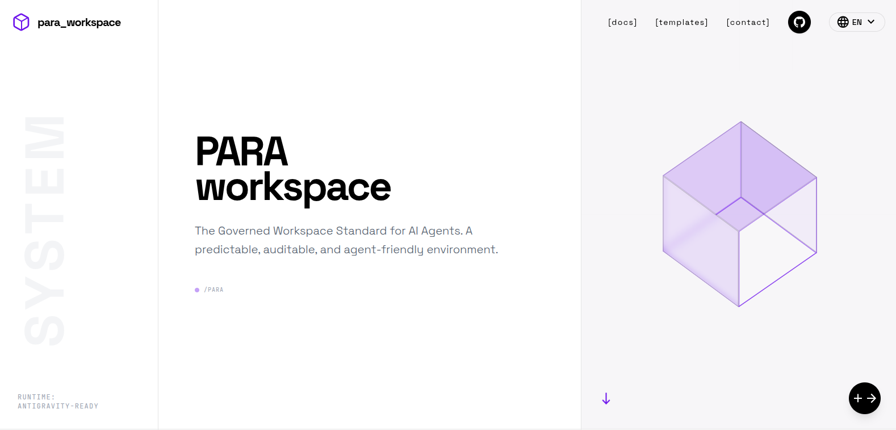

# PARA Workspace

> **The Governed Workspace Standard for AI Agents**

<div align="center">



<br/>

[](https://github.com/pageel/para-workspace)
[](#-agent-integration)
[](https://opensource.org/licenses/MIT)

[🇺🇸 English](README.md) • [🇻🇳 Tiếng Việt](./docs/README.vi.md)

</div>

---

## 🌌 Overview

**PARA Workspace** is a governed, open-source standard that defines how humans and AI agents organize knowledge and collaborate on projects. It ships as a **repo** containing a kernel (constitution), CLI tools, and templates — which generates **workspaces** where you actually work. The kernel enforces 10 invariants and 8 heuristics so every workspace is predictable, auditable, and agent-friendly.

### Three Foundational Principles

1. **Repo ≠ Workspace** — The repo contains governance (kernel, CLI, templates). It never contains user data.
2. **Workspace = Runtime** — Generated by `para init`, each workspace is a standalone instance where you and your agent work.
3. **Kernel = Constitution** — Immutable rules that all workspaces follow. Changes require an RFC + version bump.

```
Repo     (Constitution + Compiler)
  ↓ para init
Workspace (Operating System Runtime)
  ↓ agent attach
Agent    (Execution Environment)
```

---

## 📂 Architecture

### Repo Structure (This Repository)

```
para-workspace/
├── .github/             # 🤖 CI/CD — validate-pr.yml, CODEOWNERS
├── rfcs/                # 📝 RFC Process — TEMPLATE.md, proposed/, accepted/
├── kernel/              # 🧠 Constitution
│   ├── KERNEL.md
│   ├── invariants.md    # 10 hard rules (MAJOR bump)
│   ├── heuristics.md    # 9 soft conventions
│   ├── schema/          # workspace, project, backlog, catalog schemas
│   └── examples/        # valid/ + invalid/ compliance vectors
├── cli/                 # 🔧 Compiler
│   ├── para             # Entry point
│   ├── lib/             # logger.sh, validator.sh, rollback.sh
│   └── commands/        # init, scaffold, status, migrate, archive, install...
├── templates/           # 📦 Scaffolding & Governed Libraries
│   ├── common/agent/    # Centralized workflows/, rules/, skills/ + catalog.yml
│   │   └── projects/    # .project.yml template
│   └── profiles/        # dev, general, marketer, ceo presets
├── tests/               # 🧪 kernel/ + cli/ integration tests
├── docs/                # 📖 Documentation (architecture, CLI, planning, workflows)
├── CONTRIBUTING.md
├── VERSIONING.md
├── CHANGELOG.md
└── VERSION
```

### Workspace Structure (Generated by `para init`)

```
workspace/
├── Projects/            # ⚡ Active work with deadlines
│   └── <project>/
│       ├── project.md   # YAML frontmatter contract
│       ├── sessions/    # Daily session logs
│       ├── artifacts/   # tasks/backlog.md, plans/, outputs/
│       └── docs/        # Project documentation
├── Areas/               # 🛡️ Stable knowledge & SOPs
│   ├── Workspace/       # Session master log, SYNC.md
│   └── Learning/        # Knowledge capture
├── Resources/           # 📚 References & read-only sources
│   └── references/      # Cloned repos, libraries, examples
├── Archive/             # ❄️ Cold storage
├── _inbox/              # 📥 Uncategorized landing zone
├── .agent/              # 🤖 Agent runtime (governed, mutable)
│   ├── workflows/       # Active workflows (synced from catalog)
│   ├── rules/           # Active rules (synced from catalog)
│   └── skills/          # Optional skills
├── .para/               # 🔒 System state
│   ├── audit.log        # Append-only operation log
│   ├── migrations/      # Migration history
│   └── backups/         # Pre-migrate & workflow snapshots
├── .para-workspace.yml  # Workspace config & kernel version
└── README.md
```

---

## 📥 Installation

### Quick Start

Open your workspace directory (e.g., in Antigravity or your IDE) and follow these steps:

```bash
# 1. Clone repo into Resources (reference source, not a user project)
mkdir -p Resources/references
git clone https://github.com/pageel/para-workspace.git Resources/references/para-workspace

# 2. Set executable permissions (Linux/macOS only)
chmod +x Resources/references/para-workspace/cli/para
chmod +x Resources/references/para-workspace/cli/commands/*.sh

# 3. Initialize your workspace with a profile
./Resources/references/para-workspace/cli/para init --profile=dev --lang=en

# 4. Verify everything works
./para status
```

> **What just happened?**
>
> 1. The repo lives at `Resources/references/para-workspace/` — it's a reference source for governance, not a user project.
> 2. `chmod +x` ensures all CLI scripts are executable (required on Linux/macOS).
> 3. `para init` creates the PARA directory structure (including `_inbox/`), runs `install.sh` automatically
>    to sync kernel, workflows, governance rules, and generates a `./para` wrapper.
> 4. You can now use `./para` from your workspace root for all commands.

### Updating

```bash
# Pull latest from GitHub and re-sync workspace
./para update
```

This will `git pull` the repo and re-run `install.sh` to sync kernel, workflows, and governance. Existing files are backed up to `.bak` before overwriting.

### Available Profiles

| Profile                                               | Description                         | Best For                |
| ----------------------------------------------------- | ----------------------------------- | ----------------------- |
| [`general`](./templates/profiles/general/README.md)   | Minimal PARA structure              | Personal PKM            |
| [`dev`](./templates/profiles/dev/README.md)           | Technical Areas + AI tooling        | Software developers     |
| [`marketer`](./templates/profiles/marketer/README.md) | Campaign & customer Areas           | Marketing professionals |
| [`ceo`](./templates/profiles/ceo/README.md)           | Strategy & organizational oversight | Founders & leadership   |

### What `para init` Does

- ✅ Creates `Projects/`, `Areas/`, `Resources/`, `Archive/`, and `_inbox/`
- ✅ Sets **executable permissions** on all CLI scripts
- ✅ Runs **`install.sh`** automatically, which:
  - Syncs **governed workflows** from `catalog.yml` into `.agent/workflows/`
  - Syncs **governed rules** from `catalog.yml` into `.agent/rules/`
  - Syncs **skills** into `.agent/skills/` (if profile includes them)
  - Creates **`./para`** wrapper at workspace root
  - Backs up conflicting files to `.bak`
- ✅ Generates **`.para-workspace.yml`** with kernel version tracking
- ✅ Initializes **`.para/`** state (audit.log, migrations/, backups/) for full auditability

---

## 🧠 The Kernel

The Kernel is the **constitution** of PARA Workspace — the rules that all workspaces must follow.

### Invariants (Hard Rules — change = MAJOR bump)

| #   | Rule                                           |
| --- | ---------------------------------------------- |
| I1  | PARA directory structure is mandatory          |
| I2  | Hybrid 3-file task model (backlog = canonical) |
| I3  | kebab-case project naming                      |
| I4  | No active tasks = inactive project             |
| I5  | Areas contain no runtime tasks                 |
| I6  | Archive is immutable cold storage              |
| I7  | Seeds are raw ideas, not tasks                 |
| I8  | No loose files at workspace root               |
| I9  | Resources are read-only references             |
| I10 | Repo ↔ Workspace separation                    |

### Heuristics (Soft Rules — change = MINOR/PATCH)

| #   | Guideline                                                  |
| --- | ---------------------------------------------------------- |
| H1  | Naming conventions (kebab-case, PascalCase)                |
| H2  | Context loading priority                                   |
| H3  | Semantic versioning with approval levels                   |
| H4  | Standard project directory structure                       |
| H5  | Beads lifecycle                                            |
| H6  | VCS & Git boundaries                                       |
| H7  | Cross-project references via Resources                     |
| H8  | Workflow kernel compatibility                              |
| H9  | Governed libraries require `catalog.yml` with `kernel_min` |

### Kernel ↔ Workspace Contracts

| File                         | Schema                  | Enforced By                    |
| ---------------------------- | ----------------------- | ------------------------------ |
| `.para-workspace.yml`        | `workspace.schema.json` | `para init`, `para status`     |
| `Projects/*/.project.yml`    | `project.schema.json`   | `para scaffold`, `para review` |
| `artifacts/tasks/backlog.md` | `backlog.schema.json`   | `para verify`                  |
| `*/catalog.yml`              | `catalog.schema.json`   | `para install`, `para update`  |

---

## 🛠️ CLI Reference

```bash
# Core Commands
para init [--profile=X] [--lang=X] [--path=X]  # Create workspace
para scaffold {project|area|resource} <name>     # Create items
para status [--json]                             # Workspace health
para archive <type>/<name> [--force]             # Cold storage
para migrate [--from=X] [--to=Y] [--dry-run]    # Version upgrade
para install [--force]                           # Sync from repo

# Dev Commands
para plan <proj> <desc>       # Implementation plan
para verify <proj> [desc]     # Task verification
para review                   # Deep workspace audit

# System Commands
para config [key] [value]     # Workspace settings
para work <command>           # Manage workflows
para rule <command>           # Manage rules
```

---

## 📑 Workflow Catalog

| Command              | Description                                                |
| :------------------- | :--------------------------------------------------------- |
| **`/backlog`**       | Manage project tasks via canonical backlog.md              |
| **`/backup`**        | Backup workflows, rules, and config                        |
| **`/config`**        | Manage workspace configuration                             |
| **`/end`**           | Close session with PARA classification + automated cleanup |
| **`/inbox`**         | Categorize files from `_inbox/` into PARA                  |
| **`/install`**       | Intelligent installer (handles updates/merges)             |
| **`/learn`**         | Capture lessons into Areas/Learning                        |
| **`/merge`**         | Semantic merge for workflow conflicts                      |
| **`/new-project`**   | Initialize new project with scaffolding                    |
| **`/open`**          | Start session with context + plan phase loading            |
| **`/para`**          | Master controller for workspace management                 |
| **`/para-audit`**    | Macro Assessor for tracking workspace structural drift     |
| **`/para-rule`**     | Manage, install, and standardize agent rules               |
| **`/para-workflow`** | Manage, install, and standardize agent workflows           |
| **`/plan`** ✨       | Create, review, and update implementation plans            |
| **`/push`**          | Fast commit and push to GitHub                             |
| **`/release`**       | Pre-release quality gate                                   |
| **`/retro`**         | Project retrospective before archiving                     |
| **`/verify`**        | Verify task completion with walkthroughs                   |

---

## 🧩 Task Management

PARA Workspace uses a **Hybrid 3-File Model**:

```
artifacts/tasks/
├── backlog.md          # 📌 CANONICAL — all tasks live here
├── sprint-current.md   # 🎯 DERIVED — active tasks only
└── done.md             # ✅ DERIVED — completed tasks archive
```

The agent primarily interacts with `backlog.md` via the `/backlog` workflow. `sprint-current.md` and `done.md` are derived views that keep the backlog clean.

---

## 🔄 Upgrading Versions

PARA Workspace offers two official mechanisms to upgrade to a newer version:

### Mechanism 1: Auto Update (Recommended)

For most healthy workspaces, the built-in update mechanism handles everything safely.

```bash
./para update
```

This will automatically pull the newest core code, sync the libraries, and securely move obsolete structural files to the `.para/archive/` vault without deleting your custom data (Smart Archive).

### Mechanism 2: Manual Clean Slate (For heavily modified workspaces)

If your workspace is very old (v1.3.x) or has been heavily customized, start fresh:

1. Run `para init --profile=dev --lang=en` in a completely new directory.
2. Copy your old `Projects/` directories into the `_inbox/` of the new workspace.
3. Use the `/inbox` workflow or let your AI agent sort them into the new correct structure.

---

## 🗺️ Roadmap

- [x] Cross-Project Sync Queue _(shipped in v1.3.6)_
- [x] Kernel Extraction & Repo Restructure _(shipped in v1.4.0)_
- [x] Governed Libraries, RFC Process, Workspace Runtime Safety _(shipped in v1.4.1)_
- [x] Landing Page `paraworkspace.dev` _(shipped in v1.4.1)_
- [x] Plan-Aware Workflows & Token Optimization _(shipped in v1.4.2)_
- [x] Automated Plan Cleanup via `/end [done]` _(shipped in v1.4.3)_
- [x] Safety Guardrails & Terminal Allowlist _(shipped in v1.4.5)_
- [x] Progressive Disclosure & Token/Context Optimization _(shipped in v1.4.5)_
- [ ] Multi-agent Routing
- [ ] Context Intelligence & Semantic Search

---

## 🤝 Contributing

See [CONTRIBUTING.md](./CONTRIBUTING.md) for guidelines. Key points:

- Kernel invariant changes require an **RFC + MAJOR bump** → See [rfcs/TEMPLATE.md](./rfcs/TEMPLATE.md)
- Heuristic changes require a **PR + MINOR/PATCH bump**
- All changes must pass test vectors in `kernel/examples/`

---

Built with ❤️ by **Pageel**. Standardizing the future of Agentic PKM.

_Version: 1.4.6_
