# PARA Workspace Standard

> **The Code-First Personal Knowledge Management System for Agentic Workflows**

<div align="center">


<br/>

[](https://github.com/pageel/para-workspace)
[](https://antigravity.dev)
[](https://opensource.org/licenses/MIT)
[](#-agent-integration)

[🇺🇸 English](README.md) • [🇻🇳 Tiếng Việt](./Resources/translations/README.vi.md)

</div>

---

## 🌌 Overview

**PARA Workspace** is a standardized, code-centric Personal Knowledge Management (PKM) system designed for the age of AI. It bridges the gap between human cognition and artificial intelligence by providing a structured file system layout that is both intuitive for humans and contextually rich for AI agents.

```text
 ┌─────────────────────────────────────────────────────────────┐
 │   P A R A   W O R K S P A C E    S T A N D A R D            │
 └─────────────────────────────────────────────────────────────┘
          │
          ├───► ⚡ PROJECTS  (Active Work) ───► [Goal] + [Deadline]
          │
          ├───► 🛡️ AREAS     (Responsibilities) ───► [Standard] + [Maintenance]
          │
          ├───► 📚 RESOURCES (Interests) ───► [Topic] + [Utility]
          │
          └───► ❄️ ARCHIVE   (Inactive) ───► [Completed] + [Cold Storage]
```

---

## 🌌 The PARA Lifecycle

The workspace is a living system. Information flows through categories based on its current utility, not its type.

```mermaid
graph LR
    P[⚡ Projects] -->|Completed| A[❄️ Archive]
    P -->|Generalized| AR[🛡️ Areas]
    R[📚 Resources] -->|Activated| P
    AR -->|Standardized| P
    A -->|Reference| R
```



### Why PARA for AI?

Standard PKM systems are built for human eyes. **PARA Workspace** is built for **LLM context windows**:

- **Project Isolation**: Prevent the agent from hallucinating by scoping it to one folder.
- **Contract-Based Goals**: Use YAML to force the agent to recognize deadlines and "Done Conditions".
- **Short-Term Memory**: Session logs provide the immediate "What happened last?" for seamless pick-up.
- **Long-Term Memory**: Areas and Resources store the "How we do things" permanently.

---

## 📂 Directory Structure

The workspace follows a strict hierarchy to ensure predictable navigation for both humans and agents.

### 1. **Projects/** (Active Work)

> _Goal-oriented, time-bound efforts._

Every active project lives here. A standard project folder contains:

- `repo/`: **The Source Code.** (This is the git root).
- `artifacts/`: Agent plans, tasks lists, and verification logs.
- `docs/`: Project-specific documentation (RFCs, requirements).
- `sessions/`: Daily Context Logs (The agent's memory).
- `project.md`: The Project Contract (YAML status).

### 2. **Areas/** (Responsibilities)

> _Ongoing standard maintenance with no deadline._

Long-term responsibilities that require consistent standards.

- `Areas/infra/`: Infrastructure, scripts, and CLI tools.
- `Areas/marketing/`: Brand assets, guidelines.
- `Areas/operations/`: SOPs, financial records.

### 3. **Resources/** (Interests & Assets)

> _Topics of interest and utility libraries._

Shared assets and knowledge useful across multiple projects.

- `Resources/ai-agents/`: Prompts, workflows, and skills.
- `Resources/translations/`: Localization files.
- `Resources/templates/`: Reusable code snippets.

### 4. **Archive/** (Inactive)

> _Completed or cancelled items._

When a Project is done or an Area is no longer specific, it moves here for cold storage.

---

---

## 📥 Installation

This workspace is designed to be the "Operating System" for your Antigravity agent.

### 1. Setup Structure

Create your workspace root and clone this repository into the standardized path.

> **Why not `npx`?**
> We use `git clone` so you can pull updates to the Core OS standard (`Projects/para-workspace/repo`) while keeping your personal data separate.

```bash
# 1. Create your workspace directory
mkdir WORKSPACE && cd WORKSPACE

# 2. Create the Projects/para-workspace structure (CRITICAL path)
mkdir -p Projects/para-workspace

# 3. Clone this repo into 'repo'
git clone https://github.com/pageel/para-workspace.git Projects/para-workspace/repo
```

### 2. Run Installer

The installer will set up the global `./para` command, install agent skills, and sync standard rules.

```bash
# Run the install script
./Projects/para-workspace/repo/Areas/infra/cli/install.sh
```

**What happens?**

- ✅ Creates the `./para` root command.
- ✅ Installs **PARA Kit** skills to `.agent/skills/`.
- ✅ Syncs standard **Workflows** to `.agent/workflows/`.
- ✅ Enforces valid AI rules in `.agent/rules/`.

---

## 🚀 Quick Start

Initialize your workspace with the powerhouse CLI tools:

```bash
# 🏗️ Create a new project structure
./para scaffold my-awesome-app

# 📝 Plan a complex feature with AI
./para plan my-awesome-app "Implement Secure OAuth"

# 🧪 Verify task completion via Walkthrough
./para verify my-awesome-app "OAuth Flow"

# 📊 Check workspace health & deadlines
./para status

# 🔄 Upgrade a legacy folder to PARA v1.3
./para migrate legacy-project
```

The heart of the workspace is the `/para` slash command. Ask your agent:

> "Review my workspace health" or "@[/para] standardize all projects"

---

## 🏛️ Core Pillars

The system is built on three main pillars that enable a seamless Human-AI collaboration.

| Pillar          | Layer        | Responsibility                    | Key Component                    |
| :-------------- | :----------- | :-------------------------------- | :------------------------------- |
| **🛠️ PARA CLI** | Execution    | Managing physical file structures | `Areas/infra/cli/`               |
| **🧠 PARA Kit** | Intelligence | Strategic decision making         | `.agent/skills/para-kit/`        |
| **📑 Workflow** | Automation   | Standardization of complex loops  | `Resources/ai-agents/workflows/` |

### 🛠️ PARA CLI (The Execution Layer)

A high-performance set of bash utilities designed to manage the physical structure without manual overhead.

- **Deterministic**: Ensures every project looks and feels exactly the same.
- **Fast**: Zero-dependency scripts that run instantly.
- **Informative**: Status reports with overdue detection (🔥) and progress tracking.

### 🧠 PARA Kit Skill (The Intelligence Layer)

The "Strategic Brain" that guides the agent's decision-making:

- **Decision Matrix**: Automatically chooses between fast CLI scripts or deep collaborative workflows.
- **Lifecycle Audits**: Flags stalled projects and ensures nothing stays "Unknown" for long.
- **Pattern Learning**: Identifies reusable logic to move from `Projects` to `Resources`.

### 📑 Workflow Library (The Automation Layer)

A curated catalog of pre-built, agentic workflows with `p-` prefix:

- **`/para`**: The Master Controller. Updates, installs, and audits the entire workspace.
- **`/p-kickoff`**: Structured project onboarding between Human and AI.
- **`/p-plan` & `/p-verify`**: The "Gold Standard" cycle of planning, coding, and provable verification.
- **`/p-retro`**: Extraction of lessons and patterns before moving to `Archive`.

---

## 🧩 Project Contract (Spec v1.3)

Every project is an **Executable Document**. To ensure compatibility, projects follow a strict contract:

### YAML Frontmatter (`project.md`)

```yaml
---
goal: "Launch the main landing page"
deadline: "2026-03-15"
status: "active"
dod:
  - "Lighthouse score > 90"
  - "Responsive on all devices"
last_reviewed: "2026-02-05"
---
```

### Artifact Layer

- **`artifacts/tasks.md`**: Machine-readable task tracking.
- **`artifacts/plans/`**: Logic blueprints.
- **`artifacts/walkthroughs/`**: Provable verification results.

---

## 🛡️ VCS & Security Boundaries

PARA Workspace enforces strict boundaries to keep your version control clean:

- **The `repo/` Rule**: Only changes within the `repo/` folder are eligible for `git commit/push`.
- **Local Metadata**: Session logs, drafts, and project metadata stay local by default, keeping your commit history focused on code.

---

## 🗺️ Roadmap & Community

- [x] v1.3.0 PARA Core Spec
- [ ] PARA Landing Page (`paraworkspace.dev`)
- [ ] Multi-agent Routing (RFC-0003)
- [ ] Safety Guardrails (Terminal Allowlist)

Built with ❤️ by **Pageel**. Standardizing the future of Agentic PKM.

_Latest Version: 1.3.1_
