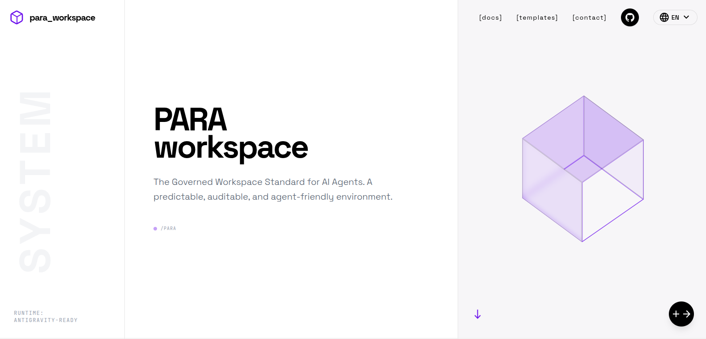
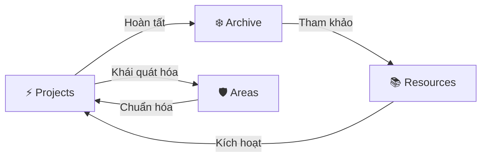

# PARA Workspace Standard

> **Hệ thống Quản trị Kiến thức Cá nhân (PKM) chuẩn Code-First dành cho AI Agentic Workflows**

<div align="center">



[](https://github.com/pageel/para-workspace)
[](https://opensource.org/licenses/MIT)
[](#-tích-hợp-agent)

[🇺🇸 English](../../README.md) • [🇻🇳 Tiếng Việt](README.vi.md)

</div>

---

## 🌌 Vòng đời PARA (The Lifecycle)

Workspace là một hệ thống sống. Thông tin luân chuyển qua các danh mục dựa trên **giá trị sử dụng hiện tại**, không phải dựa trên loại file.



### Tại sao PARA lại tối ưu cho AI?

Các hệ thống PKM thông thường được thiết kế cho mắt người. **PARA Workspace** được thiết kế cho **Context Window của LLM**:

- **Cô lập dự án (Isolation)**: Ngăn chặn Agent "ảo tưởng" (hallucination) bằng cách giới hạn phạm vi làm việc trong một thư mục duy nhất.
- **Mục tiêu theo Hợp đồng (Contracts)**: Sử dụng YAML để ép Agent phải nhận diện Deadline và "Điều kiện hoàn thành".
- **Bộ nhớ ngắn hạn**: Nhật ký Session cung cấp thông tin "Điều gì vừa xảy ra?" để Agent tiếp nối công việc mượt mà.
- **Bộ nhớ dài hạn**: Areas và Resources lưu trữ "Cách chúng ta làm việc" một cách vĩnh viễn.

---

## 🚀 Bắt đầu nhanh

Khởi tạo workspace của bạn bằng các công cụ CLI mạnh mẽ:

```bash
# 🏗️ Tạo cấu trúc dự án mới
./para scaffold my-awesome-app

# 📝 Lập kế hoạch tính năng phức tạp cùng AI
./para plan my-awesome-app "Cài đặt Secure OAuth"

# 🧪 Kiểm chứng hoàn thành task qua Walkthrough
./para verify my-awesome-app "OAuth Flow"

# 📊 Kiểm tra "sức khỏe" & thời hạn dự án
./para status

# 🔄 Nâng cấp thư mục cũ sang chuẩn PARA v1.3
./para migrate legacy-project
```

### 🤖 Lệnh tổng lực (Master Command)

Trái tim của workspace là lệnh slash `/para`. Hãy hỏi Agent của bạn:

> "Review giúp tôi sức khỏe workspace" hoặc "@[/para] chuẩn hóa tất cả dự án"

---

## 🏛️ Ba trụ cột chính

Hệ thống được xây dựng trên ba trụ cột cho phép sự cộng tác mượt mà giữa Người và AI.

| Trụ cột         | Tầng        | Trách nhiệm                      | Thành phần chính                 |
| :-------------- | :---------- | :------------------------------- | :------------------------------- |
| **🛠️ PARA CLI** | Thực thi    | Quản lý cấu trúc file vật lý     | `Areas/infra/cli/`               |
| **🧠 PARA Kit** | Trí tuệ     | Ra quyết định chiến lược         | `.agent/skills/para-kit/`        |
| **📑 Workflow** | Tự động hóa | Chuẩn hóa các quy trình phức tạp | `Resources/ai-agents/workflows/` |

### 🛠️ PARA CLI (Tầng thực thi)

Bộ công cụ bash hiệu năng cao giúp quản lý cấu trúc vật lý mà không cần thao tác thủ công.

- **Tính nhất quán**: Đảm bảo mọi dự án đều có diện mạo và trải nghiệm giống hệt nhau.
- **Tốc độ**: Scripts không phụ thuộc (zero-dependency) chạy tức thì.
- **Trực quan**: Báo cáo trạng thái kèm cảnh báo quá hạn (🔥) và theo dõi tiến độ.

### 2. 🧠 PARA Kit Skill (Tầng trí tuệ)

"Bộ não chiến lược" nằm tại `.agent/skills/para-kit/`, dẫn dắt việc ra quyết định của Agent:

- **Ma trận quyết định**: Tự động chọn giữa CLI scripts nhanh hoặc workflow cộng tác sâu.
- **Kiểm toán vòng đời**: Đánh dấu các dự án bị đình trệ và đảm bảo không có gì ở trạng thái "Unknown".
- **Cộng hưởng tri thức**: Nhận diện các pattern có thể tái sử dụng để chuyển từ `Projects` sang `Resources`.

### 3. 📑 Thư viện Workflow (Tầng tự động hóa)

Danh mục các quy trình làm việc agentic được tuyển chọn (với tiền tố `p-`):

- **`/para`**: Bộ điều khiển trung tâm. Cập nhật, cài đặt và kiểm toán toàn bộ workspace.
- **`/p-kickoff`**: Quy trình khởi động dự án bài bản giữa Người và AI.
- **`/p-plan` & `/p-verify`**: Vòng lặp "Tiêu chuẩn Vàng" gồm lập kế hoạch, viết code và kiểm chứng có bằng chứng.
- **`/p-retro`**: Trích xuất bài học và pattern trước khi đưa vào `Archive`.

---

## 🧩 Hợp đồng dự án (Spec v1.3)

Mỗi dự án là một **Tài liệu có thể thực thi**. Để đảm bảo tương thích, mọi dự án tuân thủ hợp đồng nghiêm ngặt:

### YAML Frontmatter (`project.md`)

```yaml
---
goal: "Launch the main landing page"
deadline: "2026-03-15"
status: "active"
dod:
  - "Lighthouse score > 90"
  - "Responsive on all devices"
last_reviewed: "2026-02-05"
---
```

### Lớp Artifact (Artifact Layer)

- **`artifacts/tasks.md`**: Theo dõi task dành cho máy đọc.
- **`artifacts/plans/`**: Bản thiết kế logic.
- **`artifacts/walkthroughs/`**: Kết quả kiểm chứng có bằng chứng.

---

## 🛡️ Ranh giới Git & Bảo mật

PARA Workspace thực thi ranh giới nghiêm ngặt để giữ cho lịch sử Git luôn sạch sẽ:

- **Quy tắc `repo/`**: Chỉ các thay đổi bên trong thư mục `repo/` mới được `git commit/push`.
- **Metadata cục bộ**: Nhật ký session, bản nháp và metadata dự án được giữ ở local theo mặc định. Điều này giữ cho lịch sử commit tập trung vào code.

---

## 🗺️ Lộ trình phát triển

- [x] v1.3.0 PARA Core Spec
- [ ] PARA Landing Page (`paraworkspace.dev`)
- [ ] Multi-agent Routing (RFC-0003)
- [ ] Safety Guardrails (Terminal Allowlist)

Được phát triển với ❤️ bởi **Pageel**. Chuẩn hóa tương lai của Agentic PKM.

_Phiên bản: 1.3.0_
