# PARA Workspace Standard

> **Hệ thống Quản trị Kiến thức Cá nhân (PKM) chuẩn Code-First dành cho AI Agentic Workflows**

<div align="center">


<br/>

[](https://github.com/pageel/para-workspace)
[](https://antigravity.dev)
[](https://opensource.org/licenses/MIT)
[](#-tích-hợp-agent)

[🇺🇸 English](../../README.md) • [🇻🇳 Tiếng Việt](README.vi.md)

</div>

---

## 🌌 Tổng quan (Overview)

**PARA Workspace** là một hệ thống PKM (Personal Knowledge Management) chuẩn hóa, tập trung vào code, được thiết kế cho kỷ nguyên AI. Nó kết nối khoảng cách giữa tư duy con người và trí tuệ nhân tạo bằng cách cung cấp một cấu trúc hệ thống tệp trực quan cho con người và giàu ngữ cảnh cho AI Agent.

```text
 ┌─────────────────────────────────────────────────────────────┐
 │   P A R A   W O R K S P A C E    S T A N D A R D            │
 └─────────────────────────────────────────────────────────────┘
          │
          ├───► ⚡ PROJECTS  (Dự án) ───► [Mục tiêu] + [Deadline]
          │
          ├───► 🛡️ AREAS     (Lĩnh vực) ───► [Tiêu chuẩn] + [Bảo trì]
          │
          ├───► 📚 RESOURCES (Tài nguyên) ───► [Chủ đề] + [Tiện ích]
          │
          └───► ❄️ ARCHIVE   (Lưu trữ) ───► [Hoàn tất] + [Kho lạnh]
```

---

## 🌌 Vòng đời PARA (The Lifecycle)

Workspace là một hệ thống sống. Thông tin luân chuyển qua các danh mục dựa trên **giá trị sử dụng hiện tại**, không phải dựa trên loại file.

```mermaid
graph LR
    P[⚡ Projects] -->|Hoàn tất| A[❄️ Archive]
    P -->|Khái quát hóa| AR[🛡️ Areas]
    R[📚 Resources] -->|Kích hoạt| P
    AR -->|Chuẩn hóa| P
    A -->|Tham khảo| R
```



### Tại sao PARA lại tối ưu cho AI?

Các hệ thống PKM thông thường được thiết kế cho mắt người. **PARA Workspace** được thiết kế cho **Context Window của LLM**:

- **Cô lập dự án (Isolation)**: Ngăn chặn Agent "ảo tưởng" (hallucination) bằng cách giới hạn phạm vi làm việc trong một thư mục duy nhất.
- **Mục tiêu theo Hợp đồng (Contracts)**: Sử dụng YAML để ép Agent phải nhận diện Deadline và "Điều kiện hoàn thành".
- **Bộ nhớ ngắn hạn**: Nhật ký Session cung cấp thông tin "Điều gì vừa xảy ra?" để Agent tiếp nối công việc mượt mà.
- **Bộ nhớ dài hạn**: Areas và Resources lưu trữ "Cách chúng ta làm việc" một cách vĩnh viễn.
- **Định tuyến ngữ cảnh thông minh (Context Routing)**: Các quy tắc tường minh (RFC-0003) đảm bảo Agent chỉ nạp các file thực sự liên quan, tiết kiệm token và giảm ảo tưởng.

---

## 📂 Cấu trúc Thư mục

Workspace tuân thủ một hệ thống phân cấp chặt chẽ để đảm bảo khả năng điều hướng dự đoán được cho cả người và Agent.

### 1. **Projects/** (Công việc đang hoạt động)

> _Các nỗ lực hướng tới mục tiêu, có giới hạn thời gian._

Mỗi dự án đang hoạt động sống ở đây. Một thư mục dự án tiêu chuẩn bao gồm:

- `repo/`: **Mã nguồn chính.** (Đây là gốc của git).
- `artifacts/`: Kế hoạch của Agent, danh sách task, và nhật ký kiểm chứng.
- `docs/`: Tài liệu riêng của dự án (RFCs, yêu cầu).
- `sessions/`: Nhật ký ngữ cảnh hàng ngày (Bộ nhớ của Agent).
- `project.md`: Hợp đồng dự án (Trạng thái YAML).

### 2. **Areas/** (Trách nhiệm dài hạn)

> _Bảo trì tiêu chuẩn liên tục, không có deadline._

Các trách nhiệm dài hạn yêu cầu các tiêu chuẩn nhất quán.

- `Areas/infra/`: Hạ tầng, script, và các công cụ CLI.
- `Areas/marketing/`: Tài sản thương hiệu, hướng dẫn.
- `Areas/operations/`: SOPs, hồ sơ tài chính.

### 3. **Resources/** (Sở thích & Tài sản)

> _Các chủ đề quan tâm và thư viện tiện ích._

Các tài sản dùng chung và kiến thức hữu ích cho nhiều dự án.

- `Resources/ai-agents/`: Prompts, workflows, và skills.
- `Resources/translations/`: Các tệp đa ngôn ngữ.
- `Resources/templates/`: Các đoạn code mẫu tái sử dụng.

### 4. **Archive/** (Lưu trữ)

> _Các mục đã hoàn thành hoặc đã hủy._

Khi một Dự án kết thúc hoặc một Lĩnh vực không còn cụ thể, nó sẽ được chuyển vào đây để lưu trữ lạnh.

---

## 📥 Cài đặt

Workspace này được thiết kế như một "Hệ điều hành" cho Antigravity Agent của bạn.

### 1. Thiết lập cấu trúc

Tạo thư mục gốc cho workspace và clone repository này vào đường dẫn tiêu chuẩn.

> **Tại sao không dùng `npx`?**
> Chúng tôi sử dụng `git clone` để bạn có thể cập nhật Core OS tiêu chuẩn (`Projects/para-workspace/repo`) trong khi vẫn giữ dữ liệu cá nhân của mình tách biệt.

```bash
# 1. Tạo thư mục workspace chính
mkdir WORKSPACE && cd WORKSPACE

# 2. Tạo cấu trúc Projects/para-workspace (Đường dẫn QUAN TRỌNG)
mkdir -p Projects/para-workspace

# 3. Clone repo này vào thư mục 'repo'
git clone https://github.com/pageel/para-workspace.git Projects/para-workspace/repo
```

### 2. Chạy Trình cài đặt

Trình cài đặt sẽ thiết lập lệnh `./para` toàn cục, cài đặt các skill của Agent và đồng bộ các quy tắc tiêu chuẩn.

```bash
# Chạy script cài đặt
./Projects/para-workspace/repo/Areas/infra/cli/install.sh
```

**Điều gì sẽ xảy ra?**

- ✅ Tạo lệnh `./para` ở thư mục gốc.
- ✅ Cài đặt các kỹ năng **PARA Kit** vào `.agent/skills/`.
- ✅ Đồng bộ các **Workflows** tiêu chuẩn vào `.agent/workflows/` (có thể tùy chỉnh tiền tố).
- ✅ Thực thi các quy tắc AI hợp lệ trong `.agent/rules/` (bao gồm Context Routing & Versioning).
- ✅ **Cơ chế Đồng bộ Thông minh**: Chỉ cập nhật file nếu bản mẫu gốc mới hơn hoặc file chưa tồn tại (Kiểm tra lần cuối: 1.3.6).
- ✅ **Khởi tạo Hàng đợi Đồng bộ**: Tạo file `Areas/Workspace/SYNC.md` để quản lý thông báo giữa các dự án.

---

## 🚀 Bắt đầu nhanh

Khởi tạo workspace của bạn bằng các công cụ CLI mạnh mẽ:

```bash
# 🏗️ Tạo cấu trúc dự án mới
./para scaffold my-awesome-app

# 📝 Lập kế hoạch tính năng phức tạp cùng AI
./para plan my-awesome-app "Cài đặt Secure OAuth"

# 🧪 Kiểm chứng hoàn thành task qua Walkthrough
./para verify my-awesome-app "OAuth Flow"

# 📊 Kiểm tra "sức khỏe" & thời hạn dự án
./para status

# ⚙️ Tùy chỉnh cấu hình workspace (vd: tiền tố workflow)
./para config set workflows.prefix "p-"

# 🔄 Nâng cấp thư mục cũ sang chuẩn PARA v1.3
./para migrate legacy-project
```

### 🤖 Lệnh tổng lực (Master Command)

Trái tim của workspace là lệnh slash `/para`. Hãy hỏi Agent của bạn:

> "Review giúp tôi sức khỏe workspace" hoặc "@[/para] chuẩn hóa tất cả dự án"

---

## 🏛️ Ba trụ cột chính

Hệ thống được xây dựng trên ba trụ cột cho phép sự cộng tác mượt mà giữa Người và AI.

| Trụ cột         | Tầng        | Trách nhiệm                      | Thành phần chính                 |
| :-------------- | :---------- | :------------------------------- | :------------------------------- |
| **🛠️ PARA CLI** | Thực thi    | Quản lý cấu trúc file vật lý     | `Areas/infra/cli/`               |
| **🧠 PARA Kit** | Trí tuệ     | Ra quyết định chiến lược         | `.agent/skills/para-kit/`        |
| **📑 Workflow** | Tự động hóa | Chuẩn hóa các quy trình phức tạp | `Resources/ai-agents/workflows/` |

### 🛠️ PARA CLI (Tầng thực thi)

Bộ công cụ bash hiệu năng cao giúp quản lý cấu trúc vật lý mà không cần thao tác thủ công.

- **Tính nhất quán**: Đảm bảo mọi dự án đều có diện mạo và trải nghiệm giống hệt nhau.
- **Tốc độ**: Scripts không phụ thuộc (zero-dependency) chạy tức thì.
- **Trực quan**: Báo cáo trạng thái kèm cảnh báo quá hạn (🔥) và theo dõi tiến độ.

### 🧠 PARA Kit Skill (Tầng trí tuệ)

"Bộ não chiến lược" dẫn dắt việc ra quyết định của Agent:

- **Ma trận quyết định**: Tự động chọn giữa CLI scripts nhanh hoặc workflow cộng tác sâu.
- **Định tuyến thông minh**: Thực thi phân cấp nạp ngữ cảnh nghiêm ngặt (Project -> Areas -> Resources).
- **Vòng đời Beads**: Chủ động quản lý các điểm ma sát và "tốt nghiệp" kiến thức khi lưu trữ.
- **Kiểm toán vòng đời**: Đánh dấu các dự án bị đình trệ và đảm bảo không có gì ở trạng thái "Unknown".

### 📑 Thư viện Workflow (Tầng tự động hóa)

Cơ chế được tuyển chọn để **chuẩn hóa các vòng lặp cộng tác phức tạp** giữa con người và AI. Mặc dù danh sách đầy đủ nằm trong [Mục lục](#-danh-mục-workflow--quy-tắc), các luồng cốt lõi này định hình trải nghiệm PARA:

- **`/para`**: **Bộ điều khiển trung tâm (Master Controller)**. Cập nhật, cài đặt và kiểm toán toàn bộ workspace.
- **`/install`**: Trình cài đặt thông minh cho rules và workflows (Bắt đầu tại đây để cập nhật).
- **`/kickoff`**: Quy trình khởi động dự án bài bản giữa Người và AI.
- **`/plan` & `/verify`**: Vòng lặp "Tiêu chuẩn Vàng" gồm lập kế hoạch, viết code và kiểm chứng có bằng chứng.
- **`/retro`**: Trích xuất bài học và pattern trước khi đưa vào `Archive`.

> **Mẹo:** Lệnh `/para` là cổng thông tin của bạn. Nó có thể điều hướng đến bất kỳ quy trình làm việc nào khác hoặc thực hiện kiểm tra tình trạng toàn hệ thống.

---

## 📚 Danh mục Workflow & Quy tắc

`para-workspace` đi kèm với một bộ sưu tập các tính năng được tích hợp sẵn trong `.agent/` (hoặc `Resources/ai-agents/`).

### Workflows

| Lệnh               | Mô tả                                                                    |
| :----------------- | :----------------------------------------------------------------------- |
| **`/backlog`**     | Quản lý tính năng và lỗi của dự án với theo dõi trạng thái chuẩn hóa.    |
| **`/backup`**      | Sao lưu workflows, rules, và các file cấu hình quan trọng.               |
| **`/config`**      | Quản lý cấu hình workspace (ví dụ: tiền tố) và metadata.                 |
| **`/end`**         | Ghi nhận session với phân loại PARA và hàng đợi đồng bộ liên dự án.      |
| **`/install`**     | Trình cài đặt thông minh cho workflow và rule (xử lý cập nhật/hợp nhất). |
| **`/merge`**       | Công cụ hợp nhất ngữ nghĩa để giải quyết xung đột workflow.              |
| **`/new-project`** | Khởi tạo dự án mới với scaffolding và artifacts chuẩn.                   |
| **`/open`**        | Bắt đầu session với ngữ cảnh, backlog và thông báo từ hàng đợi đồng bộ.  |
| **`/para`**        | Bộ điều khiển chính để kiểm toán và quản lý workspace.                   |
| **`/push`**        | Commit và push thay đổi lên GitHub nhanh chóng với xác minh.             |
| **`/release`**     | Cổng chất lượng trước khi phát hành và danh sách kiểm tra.               |
| **`/retro`**       | Thực hiện hồi tưởng dự án trước khi lưu trữ.                             |
| **`/rule`**        | Quản lý và thực thi các quy tắc workspace.                               |
| **`/verify`**      | Xác minh hoàn thành nhiệm vụ bằng cách sử dụng hướng dẫn và bằng chứng.  |

### Rules (Quy tắc)

| Quy tắc                  | Mô tả                                                            |
| :----------------------- | :--------------------------------------------------------------- |
| **`context-rules.md`**   | RFC-0003: Quy tắc định tuyến để tải ngữ cảnh hiệu quả.           |
| **`naming.md`**          | Quy ước đặt tên chuẩn (`kebab-case`, `PascalCase`, v.v.).        |
| **`para-discipline.md`** | Các nguyên tắc cốt lõi của kiến trúc PARA.                       |
| **`versioning.md`**      | Chiến lược kiểm soát phiên bản (v1.3.x) và chính sách phát hành. |

---

## 🧩 Hợp đồng dự án (Spec v1.3)

Mỗi dự án là một **Tài liệu có thể thực thi**. Để đảm bảo tương thích, mọi dự án tuân thủ hợp đồng nghiêm ngặt:

### YAML Frontmatter (`project.md`)

```yaml
---
goal: "Launch the main landing page"
deadline: "2026-03-15"
status: "active"
dod:
  - "Lighthouse score > 90"
  - "Responsive on all devices"
last_reviewed: "2026-02-05"
---
```

### Lớp Artifact (Artifact Layer)

- **`artifacts/tasks.md`**: Theo dõi task dành cho máy đọc.
- **`artifacts/plans/`**: Bản thiết kế logic.
- **`artifacts/walkthroughs/`**: Kết quả kiểm chứng có bằng chứng.

---

## 🛡️ Ranh giới Git & Bảo mật

PARA Workspace thực thi ranh giới nghiêm ngặt để giữ cho lịch sử Git luôn sạch sẽ:

- **Quy tắc `repo/`**: Chỉ commit các thay đổi trong `repo/`. Metadata và session được giữ ở local theo mặc định để giữ lịch sử commit tập trung vào code.
- **Chiến lược Phiên bản**: Tuân thủ nhánh `1.3.x`. Mọi đề xuất nâng cấp cần sự chấp thuận của người dùng.
  - **Phiên bản MAJOR (Cấp 1)**: Bắt buộc phải có **Bản kế hoạch triển khai (Plan)** và khớp với **Lộ trình (Roadmap)** của dự án.

---

## 🔗 Hàng đợi Đồng bộ Liên dự án (Cross-Project Sync Queue)

Khi các dự án phụ thuộc lẫn nhau (ví dụ: website giới thiệu framework), thay đổi ở dự án này cần được lan truyền sang dự án kia. PARA Workspace giải quyết vấn đề này bằng **Hàng đợi Đồng bộ Tập trung** — một file duy nhất đóng vai trò bảng thông báo.

### Cách hoạt động

```mermaid
graph LR
    E["/end tại upstream"] -->|thêm 1 dòng| S["Areas/Workspace/SYNC.md"]
    O["/open tại downstream"] -->|đọc & lọc| S
    O -->|hiển thị cảnh báo| U["User thấy sync pending"]
```



1. **Khai báo quan hệ** trong `metadata.json` sử dụng trường `downstream`:
   ```json
   "para-workspace": {
     "downstream": ["website-paraworkspace"]
   }
   ```
2. **`/end`** kiểm tra các dự án downstream và nối thêm một dòng thông báo vào `SYNC.md`.
3. **`/open`** đọc `SYNC.md`, lọc theo tên dự án, và cảnh báo người dùng nếu có sync đang chờ xử lý.
4. Sau khi xử lý, mục đó sẽ chuyển từ `Pending` sang `Completed`.

### Tại sao thiết kế này tối ưu?

| Chỉ số          | File riêng từng dự án          | Hàng đợi tập trung               |
| :-------------- | :----------------------------- | :------------------------------- |
| Chi phí `/end`  | Ghi N file (1 file/downstream) | **Ghi nối 1 file**               |
| Chi phí `/open` | Đọc thêm file riêng            | **~0** (cùng folder SESSION_LOG) |
| Tổng thao tác   | **N+1**                        | **2** (hằng số)                  |

---

## 🗺️ Lộ trình phát triển

- [x] v1.3.2 Trí tuệ & Tùy chỉnh
- [x] v1.3.6 Hàng đợi Đồng bộ Liên dự án
- [ ] PARA Landing Page (`paraworkspace.dev`)
- [x] Multi-agent Routing (RFC-0003)
- [ ] Safety Guardrails (Terminal Allowlist)

Được phát triển với ❤️ bởi **Pageel**. Chuẩn hóa tương lai của Agentic PKM.

_Phiên bản mới nhất: 1.3.6_
