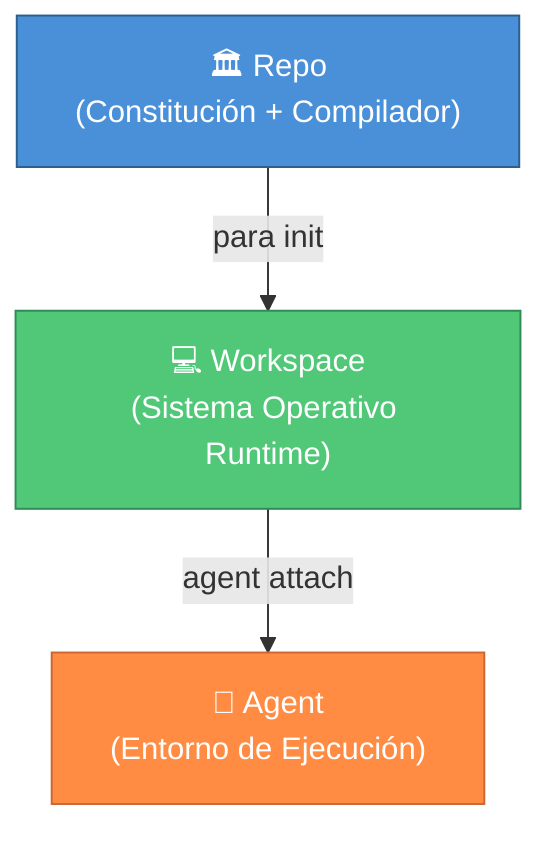

<div align="center">


# PARA Workspace

**El Framework de Espacio de Trabajo para Humanos y Agentes IA**

[](https://opensource.org/licenses/MIT)
[](../../CHANGELOG.md)

[](https://antigravity.google/)

<a href="../../README.md"><b>🇺🇸 English</b></a> •
    <a href="./vi-VN.md"><b>🇻🇳 Tiếng Việt</b></a> •
    <a href="./zh-CN.md"><b>🇨🇳 中文</b></a> •
    <a href="./es-ES.md"><b>🇪🇸 Español</b></a> •
    <a href="./fr-FR.md"><b>🇫🇷 Français</b></a>

</div>

---

| Sección | Descripción |
| :-- | :-- |
| [🌌 Descripción General](#-descripción-general) | Qué es PARA Workspace, sus tres principios fundamentales |
| [📂 Arquitectura](#-arquitectura) | Estructura del repositorio + estructura del espacio de trabajo generado |
| [📥 Instalación](#-instalación) | Requisitos previos, configuración, perfiles, solución de problemas |
| [🧠 El Kernel](#-el-kernel) | Invariantes, reglas heurísticas, contratos |
| [🛠️ Referencia de CLI](#-referencia-cli) | Todos los comandos de CLI |
| [📑 Catálogo de Workflows](#-catálogo-de-workflows) | 27 flujos de trabajo (workflows) gobernados |
| [🛡️ Catálogo de Reglas](#-catálogo-de-reglas) | 11 reglas de gobernanza |
| [🧩 Catálogo de Skills](#-catálogo-de-skills) | 9 habilidades (skills) reutilizables |
| [🔌 Sistema de Herramientas](#-sistema-de-herramientas-v180) | Instalar complementos agentic externos |
| [🧩 Gestión de Tareas](#-gestión-de-tareas-modelo-híbrido-de-3-archivos) | Modelo híbrido de 3 archivos |
| [🔄 Actualización](#-actualizando-versiones) | Actualización automática + instalación limpia |
| [🗺️ Hoja de Ruta](#-hoja-de-ruta) | Historial de versiones + próximas características |

## 🌌 Descripción General

**PARA Workspace** es un framework de espacio de trabajo de código abierto que define cómo los humanos y los Agentes de Inteligencia Artificial organizan el conocimiento y colaboran en proyectos. Se distribuye como un **repositorio (repo)** que contiene un kernel (constitución), herramientas CLI y plantillas — a partir de los cuales se genera el **espacio de trabajo (workspace)** en el que usted realmente trabajará. El kernel impone invariantes y reglas heurísticas para que cada espacio de trabajo sea predecible, auditable y compatible con los Agentes IA.

### Tres Principios Fundamentales

1. **Repo ≠ Workspace (Repositorio ≠ Espacio de trabajo)** — El repositorio contiene gobernanza (kernel, CLI, plantillas) y nunca contiene datos del usuario.
2. **Workspace = Runtime (Espacio de trabajo = Tiempo de ejecución)** — Generado por `para init`, cada espacio de trabajo es una instancia independiente donde usted y su Agente trabajan.
3. **Kernel = Constitution (Kernel = Constitución)** — Reglas inmutables que todos los espacios de trabajo deben seguir. Cualquier modificación requiere un RFC y aumento de la versión.



---

## 📂 Arquitectura

### Estructura del Repositorio (Este Repositorio)

```
para-workspace/
├── .github/             # 🤖 CI/CD — validate-pr.yml, CODEOWNERS
├── rfcs/                # 📝 Proceso RFC — TEMPLATE.md
├── kernel/              # 🧠 Constitución
│   ├── KERNEL.md
│   ├── invariants.md    # 11 reglas estrictas (modificación requiere bumping MAJOR)
│   ├── heuristics.md    # 10 convenciones flexibles
│   ├── schema/          # Esquemas JSON para workspace, project, backlog, etc.
│   └── examples/        # Ejemplos válidos/inválidos de cumplimiento
├── cli/                 # 🔧 Compilador
│   ├── para             # Punto de entrada (compatible con Bash 3.2+)
│   ├── lib/             # Bibliotecas principales (logger, validator, rollback)
│   └── commands/        # Comandos (init, scaffold, status, migrate, install, etc.)
├── templates/           # 📦 Scaffolding & Bibliotecas Gobernadas
│   ├── common/agents/   # Flujos de trabajo, reglas, skills y catalog.yml
│   │   └── projects/    # Plantilla .project.yml
│   └── profiles/        # Preajustes (dev, general)
├── tests/               # 🧪 Pruebas de integración
├── docs/                # 📖 Documentación
├── CONTRIBUTING.md
├── VERSIONING.md
├── CHANGELOG.md
└── VERSION
```

### Estructura del Workspace (Generado por `para init`)

```
<your-workspace>/
├── Projects/                          # Tareas orientadas a objetivos
│   ├── my-app/                        # Proyecto estándar (type: standard)
│   │   ├── repo/                      #   Código fuente (repositorio git)
│   │   ├── artifacts/                 #   Planes, tareas, decisiones
│   │   ├── sessions/                  #   Registros de sesión
│   │   ├── docs/                      #   Documentación del proyecto
│   │   └── project.md                 #   Contrato del proyecto
│   └── my-ecosystem/                  # Proyecto Ecosistema (type: ecosystem)
│       ├── artifacts/                 #   Planes compartidos y backlog
│       └── project.md                 #   satellites: [app, api, ...], NO repo/
├── Areas/                             # Responsabilidades continuas (Ej: salud, finanzas)
│   ├── Workspace/                     # Registro maestro de sesión, auditorías, cola SYNC
│   └── Learning/                      # Conocimiento compartido (desde /learn)
├── Resources/                         # Referencias y herramientas
│   ├── ai-agents/                     # Instantánea del Kernel y bibliotecas gobernadas
│   └── references/                    # Repositorio original de PARA (solo lectura)
├── Archive/                           # Almacenamiento en frío para completados
├── _inbox/                            # Zona de aterrizaje temporal para descargas
├── .agents/                           # Copias de las bibliotecas gobernadas (Auto-sincronizado)
│   ├── rules.md                       # Índice disparador de reglas (siempre cargado)
│   ├── skills.md                      # Índice disparador de skills
│   ├── rules/                         # Reglas activas del agente
│   ├── skills/                        # Skills activas del agente
│   └── workflows/                     # Flujos de trabajo activos del agente
├── .para/                             # Estado del sistema (NO EDITAR)
│   ├── archive/                       # Bóveda de archivos obsoletos
│   ├── backups/                       # Copias de seguridad fechadas
│   └── audit.log                      # Historial de acciones (Auditoría)
├── para                               # Script CLI (Bootstrapper)
└── .para-workspace.yml                # Configuración de metadatos raíz del workspace
```

---

## 📥 Instalación

### Requisitos Previos

- **Plataforma de Agente IA** (ver compatibilidades más adelante)
- **Git** (requerido — para clonar y actualizar)
- **Bash** 3.2+ (Nativo en Linux/macOS, Git Bash o WSL en Windows)

### Paso 1: Clonar e Instalar

```bash
# Clonar el repositorio en la ubicación correcta
mkdir -p Resources/references
git clone https://github.com/pageel/para-workspace.git Resources/references/para-workspace

# Establecer permisos de ejecución
chmod +x Resources/references/para-workspace/cli/para
chmod +x Resources/references/para-workspace/cli/commands/*.sh

# Inicializar tu espacio de trabajo con un perfil
./Resources/references/para-workspace/cli/para init --profile=dev --lang=en
```

### Paso 2: Verificar

```bash
./para status
# ✅ Si ves el reporte de salud del sistema, la instalación fue exitosa
```

### Actualización

```bash
# Extraer la última versión desde GitHub y resincronizar el workspace
./para update

# Previsualizar cambios antes de aplicarlos
./para update --dry-run
```

---

## 🧠 El Kernel

El Kernel es la **constitución** de PARA Workspace — las reglas que todos los espacios de trabajo deben seguir.

### Invariantes (Reglas estrictas)
11 reglas fundamentales (cualquier modificación requiere versión MAJOR), tales como `I1` (Estructura de directorio rígida), `I2` (Modelo de 3 archivos híbrido), `I10` (Separación Repo/Workspace), etc.

### Heurísticas (Reglas flexibles)
10 pautas (su modificación requiere parámetros MINOR/PATCH) que cubren nombramiento, prioridades de contextos, y manejo de elementos de conocimiento (KI).

---

## 🛠️ Referencia CLI

```bash
# Comandos principales
para init [--profile] [--lang]  # Crea un workspace
para status [--json]            # Chequea la salud del sistema
para update                     # Actualiza y migra automáticamente
para scaffold <type> <name>     # Crea estructuras de carpetas
para install [--force]          # Sincroniza bibliotecas gobernadas
para archive <type> <name>      # Examen de graduación y archivo
para migrate [--from] [--to]    # Utilidad de migración

# Agentes
@[/para-workflow] list          # Administra workflows
@[/para-rule] list              # Administra reglas

# Gestión de Herramientas (v1.8.0)
para install-tool <name>        # Instalar un complemento desde el registro
para remove-tool <name>         # Eliminar complemento instalado
para list-tools                 # Listar complementos instalados
```

---

## 📑 Catálogo de Workflows, Reglas y Skills

El sistema incluye:
- **27 Workflows:** Desde gestores de tareas (`/backlog`), creación de especificaciones (`/spec`), flujos de apertura (`/open`), auditorías (`/para-audit`), sistemas de conocimiento cruzado (`/para-knowledge`), hasta generación de contenido (`/write`) y telemetría (`/logs`).
- **11 Reglas de Gobernabilidad:** Defienden el versionado, las buenas prácticas de Git (VCS) o evitan mutaciones riesgosas. Todas optimizadas bajo un Índice Disparador.
- **9 Skills Base:** Facilitan el entendimiento de componentes estáticos como `PARA Kit`, diagramas visuales, mapas de página (`Page Map`), plantillas de redacción de contenidos (`Write Templates`), y catálogos de guardias de seguridad (`Harness Guards`).

---

## 🏗️ Arquitectura de Reglas — Carga en Dos Niveles y Defensa en Profundidad

PARA Workspace emplea una arquitectura de **Divulgación Progresiva** o "Progressive Disclosure". Solo se leen índices maestros pequeños (como `.agents/rules.md`), esto ahorra hasta el ~90% de los Tokens en tu IA.

Para proteger a la Inteligencia Artificial ante recortes de memoria (amnesia por truncamiento), se emplea un sistema Defense-in-Depth con 4 validaciones (Layer 1 al 4) y controles de Pre-Flight automatizados.

---

## 🧩 Gestión de Tareas (Modelo Híbrido de 3 Archivos)

Resuelve los problemas de la amnesia de IA fragmentando un inmenso Backlog monolítico en:
- `backlog.md` (Total y estratégico)
- `sprint-current.md` (Pista caliente activa, escribible para la IA)
- `done.md` (Log y registros en sistema append-only con etiquetas `#session`)

Iniciado mediante `/open` y cerrado con su sincronización mediante `/end`.

---

## 📚 Sistema de Conocimiento (v1.7.0)

Introduce un ecosistema de “Knowledge Items (KIs)” diseñado para integrarse nativamente con tecnologías como Antigravity. Desvincúlate de barreras locales para empacar fragmentos de conocimiento reutilizables sin caducar en carpetas de archivado.

---

## 🔌 Sistema de Herramientas (v1.8.0)

PARA Workspace admite un **Sistema de Herramientas Dinámico** extensible que le permite instalar complementos externos independientes del lenguaje (como `para-graph`) directamente en su espacio de trabajo.

Las herramientas se gestionan a través de un registro central (`registry/tools.yml`) y se instalan como tarballs independientes.

### Cómo funciona
1. **Cero Dependencias Globales**: Las herramientas se instalan localmente en `.para/tools/` para su aislamiento.
2. **Soporte Multi-Runtime**: La CLI autogenera scripts envolventes (por ejemplo, `repo/cli/commands/graph.sh`) que saben cómo invocar ejecutables de Node, Python o binarios.
3. **Mecanismo Fallback Dev/Prod**: Si el código fuente de una herramienta existe dentro del espacio de trabajo (Modo Dev), el script enruta la ejecución allí. De lo contrario, utiliza el tarball extraído (Modo Prod).

### Herramientas Disponibles

| Herramienta | Versión | Descripción |
| :--- | :--- | :--- |
| **[`para-graph`](https://github.com/pageel/para-graph)** | Grafo de Conocimiento de Código Híbrido para PARA Workspace |

### Uso

```bash
# Instalar el complemento para-graph (análisis de código estructural y servidor MCP)
./para install-tool para-graph

# Listar herramientas instaladas
./para list-tools

# Ejecutar la herramienta instalada
./para graph --help

# Eliminar herramienta
./para remove-tool para-graph
```

### Instalador de Inteligencia de Herramientas (Tool Intelligence Installer, v1.8.1)

Las herramientas pueden agrupar inteligencia de IA (workflows, skills, rules) directamente en su `tool.manifest.yml`:

```yaml
agents:
  workflows:
    - source: templates/agents/workflows/para-graph.md
      target: para-graph.md
      version: "1.8.0"
  skills:
    - source: templates/agents/skills/graph-enrichment/
      target: graph-enrichment/
      version: "1.0.0"
```

Cuando ejecuta `./para install-tool <name>`, la CLI analizará automáticamente este manifiesto y le indicará que instale la inteligencia incluida.
Puede usar `--agents` para instalar solo los agentes o `--no-agents` para omitir el mensaje.
`remove-tool` también le ofrecerá limpiar cualquier agente incluido que haya instalado.

---

## 🔄 Actualizando Versiones

Una vez que se estandaricen nuevos workflows, correcciones en kernel el comando `./para update` arrastrará todos los cambios necesarios usando Git. Tareas obsoletas se arrastrarán a una zona pasiva, y las bibliotecas serán sincronizadas atómicamente mitigando cualquier error fatal.

---

## 🗺️ Hoja de Ruta

Versión actual: **1.8.2** (MCP Auto-Setup).
Próximos lanzamientos vislumbrados: **v1.9.0** (Sistemas por Departamento) y **v1.10.0** (Fronteras Comunitarias & Confianza).

---

## 🤝 Contribuyendo

Consulte el documento [CONTRIBUTING.md](../../CONTRIBUTING.md) para los lineamientos fundamentales. Las propuestas referidas a Invariantes (Kernel) requerirán RFC formales.

---

Construido con ❤️ por **Pageel**. Estandarizando el futuro de los PKMs para Agentes.

_Versión: 1.8.2_
