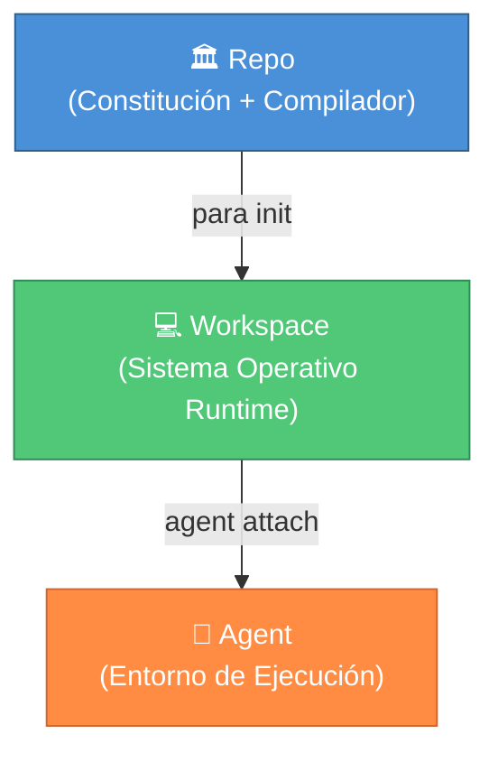

<div align="center">


# PARA Workspace

**El Framework de Espacio de Trabajo para Humanos y Agentes IA**

[](https://opensource.org/licenses/MIT)
[](../../CHANGELOG.md)

[](https://antigravity.google/)

<a href="../../README.md"><b>🇺🇸 English</b></a> •
    <a href="./vi-VN.md"><b>🇻🇳 Tiếng Việt</b></a> •
    <a href="./zh-CN.md"><b>🇨🇳 中文</b></a> •
    <a href="./es-ES.md"><b>🇪🇸 Español</b></a> •
    <a href="./fr-FR.md"><b>🇫🇷 Français</b></a>

</div>

---

> 🚧 **Traducción en progreso** — Este archivo es actualmente un marcador de posición. ¡Las contribuciones para la traducción al español son bienvenidas!
>
> Mientras tanto, consulte el [README en inglés](../../README.md) para la documentación completa.

## 🌌 Descripción General

**PARA Workspace** es un framework de espacio de trabajo de código abierto que define cómo los humanos y los agentes de IA organizan el conocimiento y colaboran en proyectos. Se distribuye como un **repositorio** que contiene un kernel (constitución), herramientas CLI y plantillas — que generan **espacios de trabajo** donde realmente trabajas.

### Tres Principios Fundamentales

1. **Repo ≠ Workspace** — El repositorio contiene gobernanza (kernel, CLI, plantillas). Nunca contiene datos de usuario.
2. **Workspace = Runtime** — Generado por `para init`, cada espacio de trabajo es una instancia independiente.
3. **Kernel = Constitución** — Reglas inmutables que todos los espacios de trabajo deben seguir.



## 📥 Instalación

```bash
# Clonar el repositorio
mkdir -p Resources/references
git clone https://github.com/pageel/para-workspace.git Resources/references/para-workspace

# Establecer permisos
chmod +x Resources/references/para-workspace/cli/para
chmod +x Resources/references/para-workspace/cli/commands/*.sh

# Inicializar el espacio de trabajo
./Resources/references/para-workspace/cli/para init --profile=dev --lang=en
```

## 🤝 Contribuir

¡Las contribuciones para la traducción completa al español son bienvenidas! Consulte [CONTRIBUTING.md](../../CONTRIBUTING.md) para las directrices.

---

Construido con ❤️ por **Pageel**. Estandarizando el futuro del PKM Agent.

_Versión: 1.7.6_
