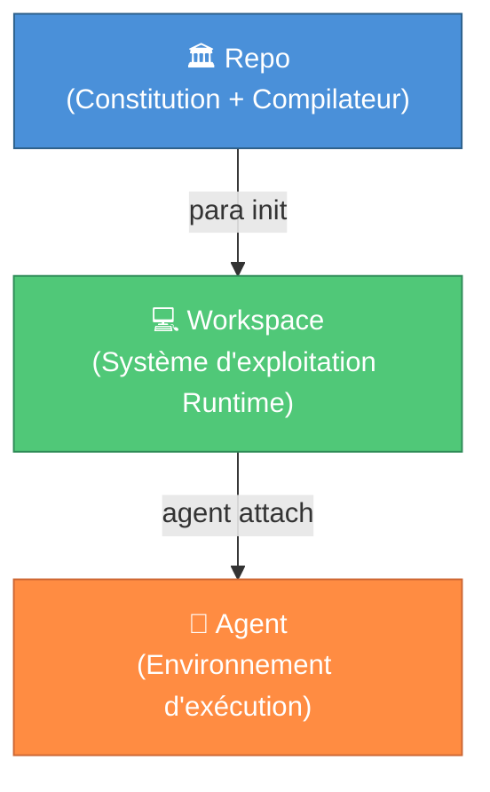

<div align="center">


# PARA Workspace

**Le Framework d'Espace de Travail pour les Humains et les Agents IA**

[](https://opensource.org/licenses/MIT)
[](../../CHANGELOG.md)

[](https://antigravity.google/)

<a href="../../README.md"><b>🇺🇸 English</b></a> •
    <a href="./vi-VN.md"><b>🇻🇳 Tiếng Việt</b></a> •
    <a href="./zh-CN.md"><b>🇨🇳 中文</b></a> •
    <a href="./es-ES.md"><b>🇪🇸 Español</b></a> •
    <a href="./fr-FR.md"><b>🇫🇷 Français</b></a>

</div>

---

> 🚧 **Traduction en cours** — Ce fichier est actuellement un espace réservé. Les contributions pour la traduction française sont les bienvenues !
>
> En attendant, veuillez consulter le [README en anglais](../../README.md) pour la documentation complète.

## 🌌 Aperçu

**PARA Workspace** est un framework d'espace de travail open source qui définit comment les humains et les agents IA organisent les connaissances et collaborent sur des projets. Il est distribué sous forme de **dépôt** contenant un noyau (constitution), des outils CLI et des templates — qui génèrent des **espaces de travail** où vous travaillez réellement.

### Trois Principes Fondamentaux

1. **Repo ≠ Workspace** — Le dépôt contient la gouvernance (noyau, CLI, templates). Il ne contient jamais de données utilisateur.
2. **Workspace = Runtime** — Généré par `para init`, chaque espace de travail est une instance autonome.
3. **Kernel = Constitution** — Règles immuables que tous les espaces de travail doivent suivre.



## 📥 Installation

```bash
# Cloner le dépôt
mkdir -p Resources/references
git clone https://github.com/pageel/para-workspace.git Resources/references/para-workspace

# Définir les permissions
chmod +x Resources/references/para-workspace/cli/para
chmod +x Resources/references/para-workspace/cli/commands/*.sh

# Initialiser l'espace de travail
./Resources/references/para-workspace/cli/para init --profile=dev --lang=en
```

## 🤝 Contribuer

Les contributions pour la traduction complète en français sont les bienvenues ! Consultez [CONTRIBUTING.md](../../CONTRIBUTING.md) pour les directives.

---

Construit avec ❤️ par **Pageel**. Standardiser l'avenir du PKM Agent.

_Version : 1.7.6_
