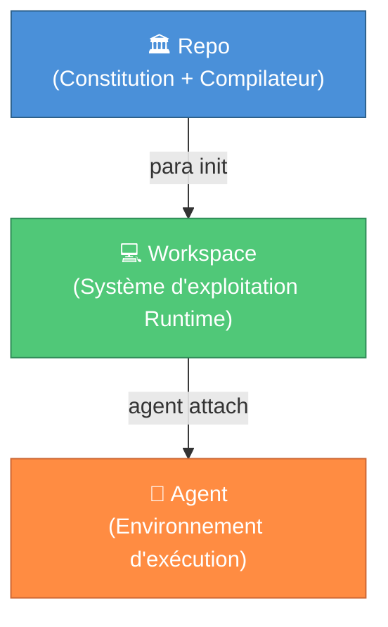

<div align="center">


# PARA Workspace

**Le Framework d'Espace de Travail pour Humains et Agents IA**

[](https://opensource.org/licenses/MIT)
[](../../CHANGELOG.md)

[](https://antigravity.google/)

<a href="../../README.md"><b>🇺🇸 English</b></a> •
    <a href="./vi-VN.md"><b>🇻🇳 Tiếng Việt</b></a> •
    <a href="./zh-CN.md"><b>🇨🇳 中文</b></a> •
    <a href="./es-ES.md"><b>🇪🇸 Español</b></a> •
    <a href="./fr-FR.md"><b>🇫🇷 Français</b></a>

</div>

---

| Section | Description |
| :-- | :-- |
| [🌌 Vue d'ensemble](#-vue-densemble) | Ce que c'est, les trois principes fondateurs |
| [📂 Architecture](#-architecture) | Structure du dépôt + structure de l'espace de travail généré |
| [📥 Installation](#-installation) | Prérequis, configuration, profils, dépannage |
| [🧠 Le Noyau](#-le-noyau) | Invariants, heuristiques, contrats |
| [🛠️ Référence CLI](#-référence-cli) | Toutes les commandes CLI |
| [📑 Catalogue des Workflows](#-catalogue-des-workflows) | 32 flux de travail (workflows) régis |
| [🛡️ Catalogue des Règles](#-catalogue-des-règles) | 14 règles de gouvernance |
| [🧩 Catalogue des Compétences](#-catalogue-des-compétences) | 21 compétences (skills) réutilisables |
| [🔌 Système d'Outils](#-système-doutils-v180) | Installer des plugins d'agents externes |
| [🧩 Gestion des Tâches](#-gestion-des-tâches-modèle-hybride-à-3-fichiers) | Modèle hybride à 3 fichiers |
| [🔄 Mise à jour](#-mise-à-jour-des-versions) | Mise à jour automatique + nouvelle installation |
| [🗺️ Feuille de Route](#-feuille-de-route) | Historique des versions + fonctionnalités prévues |

## 🌌 Vue d'ensemble

**PARA Workspace** est un framework d'espace de travail open source qui définit comment les humains et les agents d'intelligence artificielle organisent les connaissances et collaborent sur des projets. Il est distribué sous forme de **dépôt (repo)** contenant un noyau (constitution), des outils CLI et des modèles — à partir desquels est généré **l'espace de travail (workspace)** où vous travaillez réellement. Le noyau applique des invariants et des règles heuristiques afin que chaque espace de travail soit prévisible, auditable et adapté aux agents IA.

### Trois Principes Fondateurs

1. **Repo ≠ Workspace (Dépôt ≠ Espace de travail)** — Le dépôt contient la gouvernance (noyau, CLI, modèles) et ne contient jamais de données utilisateur.
2. **Workspace = Runtime (Espace de travail = Environnement d'exécution)** — Généré par `para init`, chaque espace de travail est une instance indépendante où vous et votre Agent travaillez.
3. **Kernel = Constitution (Noyau = Constitution)** — Règles immuables que tous les espaces de travail doivent suivre. Toute modification nécessite une RFC et une augmentation de version.



---

## 📂 Architecture

### Structure du Dépôt (Ce Dépôt)

```
para-workspace/
├── .github/             # 🤖 CI/CD — validate-pr.yml, CODEOWNERS
├── rfcs/                # 📝 Processus RFC — TEMPLATE.md
├── kernel/              # 🧠 Constitution
│   ├── KERNEL.md
│   ├── invariants.md    # 11 règles strictes (modification nécessite une maj MAJOR)
│   ├── heuristics.md    # 10 conventions souples
│   ├── schema/          # Schémas JSON pour workspace, project, backlog, etc.
│   └── examples/        # Exemples de conformité valides/invalides
├── cli/                 # 🔧 Compilateur
│   ├── para             # Point d'entrée (compatible Bash 3.2+)
│   ├── lib/             # Bibliothèques (logger, validator, rollback)
│   └── commands/        # Commandes (init, scaffold, status, migrate, install, etc.)
├── templates/           # 📦 Échafaudage & Bibliothèques Régies
│   ├── common/agents/   # Workflows, règles, compétences et catalog.yml
│   │   └── projects/    # Modèle .project.yml
│   └── profiles/        # Préréglages (dev, general)
├── tests/               # 🧪 Tests d'intégration
├── docs/                # 📖 Documentation
├── CONTRIBUTING.md
├── VERSIONING.md
├── CHANGELOG.md
└── VERSION
```

### Structure de l'Espace de Travail (Généré par `para init`)

```
<your-workspace>/
├── Projects/                          # Tâches orientées par objectifs
│   ├── my-app/                        # Projet standard (type: standard)
│   │   ├── repo/                      #   Code source (dépôt git)
│   │   ├── artifacts/                 #   Plans, tâches, décisions
│   │   ├── sessions/                  #   Journaux de session
│   │   ├── docs/                      #   Documentation du projet
│   │   └── project.md                 #   Contrat du projet
│   └── my-ecosystem/                  # Projet Écosystème (type: ecosystem)
│       ├── artifacts/                 #   Plans partagés et backlog
│       └── project.md                 #   satellites: [app, api, ...], PAS de repo/
├── Areas/                             # Responsabilités continues (ex: santé, finances)
│   ├── Workspace/                     # Journal de bord maître, audits, file SYNC
│   └── Learning/                      # Connaissances partagées (via /learn)
├── Resources/                         # Références et outils
│   ├── ai-agents/                     # Capture du Noyau et bibliothèques régies
│   └── references/                    # Dépôt original PARA (lecture seule)
├── Archive/                           # Stockage inactif pour éléments terminés
├── _inbox/                            # Zone d'atterrissage pour téléchargements externes
├── .agents/                           # Copies des bibliothèques régies (Auto-synchronisées)
│   ├── rules.md                       # Index déclencheur des règles (toujours chargé)
│   ├── skills.md                      # Index déclencheur des compétences
│   ├── rules/                         # Règles d'agent actives
│   ├── skills/                        # Compétences d'agent actives
│   └── workflows/                     # Flux de travail d'agent actifs
├── .para/                             # État du système (NE PAS MODIFIER)
│   ├── archive/                       # Coffre d'archives obsolètes
│   ├── backups/                       # Sauvegardes horodatées
│   └── audit.log                      # Historique d'audit des actions
├── para                               # Script CLI (Bootstrapper)
└── .para-workspace.yml                # Configuration des métadonnées racinaires
```

---

## 📥 Installation

### Prérequis

- **Plateforme d'Agent IA** (voir compatibilités ci-dessous)
- **Git** (requis — pour cloner et mettre à jour)
- **Bash** 3.2+ (Natif sur Linux/macOS, Git Bash ou WSL sur Windows)

### Étape 1 : Cloner et Installer

```bash
# Cloner le dépôt au bon endroit
mkdir -p Resources/references
git clone https://github.com/pageel/para-workspace.git Resources/references/para-workspace

# Accorder les permissions d'exécution
chmod +x Resources/references/para-workspace/cli/para
chmod +x Resources/references/para-workspace/cli/commands/*.sh

# Initialiser l'espace de travail avec un profil
./Resources/references/para-workspace/cli/para init --profile=dev --lang=en
```

### Étape 2 : Vérifier

```bash
./para status
# ✅ Si vous voyez le rapport de santé, l'installation est réussie
```

### Mise à jour

```bash
# Extraire la dernière version de GitHub et resynchroniser l'espace
./para update

# Prévisualiser les changements avant application
./para update --dry-run
```

---

## 🧠 Le Noyau

Le Noyau est la **constitution** de PARA Workspace — les règles que tous les espaces de travail doivent respecter.

### Invariants (Règles strictes)
11 règles fondamentales (toute modification exige une version MAJOR), telles que `I1` (Structure stricte des dossiers), `I2` (Modèle hybride à 3 fichiers), `I10` (Séparation Repo/Workspace), etc.

### Heuristiques (Règles souples)
10 directives (modification nécessitant des paramètres MINOR/PATCH) couvrant le nommage, les priorités contextuelles et la gestion des éléments de connaissances (KI).

---

## 🛠️ Référence CLI

```bash
# Commandes principales
para init [--profile] [--lang]  # Créer un espace de travail
para status [--json]            # Vérifier la santé du système
para update                     # Mettre à jour et migrer
para scaffold <type> <name>     # Créer une architecture de dossiers
para install [--force]          # Synchroniser les bibliothèques régies
para archive <type> <name>      # Revue et archivage
para migrate [--from] [--to]    # Utilitaire de migration

# Commandes IA
@[/para-workflow] list          # Gérer les workflows
@[/para-rule] list              # Gérer les règles

# Gestion des Outils (v1.8.0)
para install-tool <name>        # Installer un plugin depuis le registre
para remove-tool <name>         # Supprimer le plugin installé
para list-tools                 # Lister les plugins installés
```

---

## 📑 Catalogue (Workflows, Règles et Compétences)

Le système intègre :
- **32 Workflows :** Des gestionnaires de tâches (`/backlog`), création de spécifications (`/spec`), des scénarios d'ouverture (`/open`), des audits (`/para-audit`), des systèmes de connaissances (`/para-knowledge`), de revues QA (`/qa`), jusqu'à la création de contenu (`/write`), la télémétrie (`/logs`), ainsi que les workflows intégrés de staging (`/staging`), d'exécution vibecode (`/vibecode`), de sécurité (`/scan-sec`) et de ressources (`/resource`).
- **14 Règles de Gouvernance :** Protègent le versionnement, les bonnes pratiques Git (VCS), la politique graph-first, la gestion des outils (tool routing) ou évitent les mutations risquées.
- **21 Compétences (Skills) :** Facilitent la compréhension des composants statiques (`PARA Kit`), des diagrammes, de l'architecture des pages web (`Page Map`), des modèles de rédaction (`Write Templates`), des catalogues de gardes de sécurité (`Harness Guards`), `Spec Templates`, revues `QA`, lignes directrices `TDD`, extensions d'audit de journaux (`Logs Audit`), `HTML Renderer`, `New Project`, `para-graph`, `Staging Templates`, `Vibecode Execution Templates`, `Vulnerability Scanner Templates`, `Resource Study Templates` et `Sidecar Skill Governance`.

---

## 🏗️ Architecture des Règles — Chargement à Deux Niveaux & Défense en Profondeur

PARA Workspace s'appuie sur une structure de **Divulgation Progressive** (Progressive Disclosure). L'agent IA lit seulement des index maîtres très courts (`.agents/rules.md`), économisant ainsi environ 90 % de tokens.

Pour protéger l'Intelligence Artificielle de la perte de mémoire (amnésie après de longues conversations), quatre couches de validation (Defense-in-Depth) et des contrôles pré-vol automatiques sont en place.

---

## 🧩 Gestion des Tâches (Modèle Hybride à 3 Fichiers)

Résout les problèmes d'amnésie des IA en divisant le monolithe du Backlog en :
- `backlog.md` (Total et stratégique)
- `sprint-current.md` (Piste active modifiable par l'IA)
- `done.md` (Historique ajout-seulement avec balises `#session`)

Initié avec `/open` et terminé/synchronisé avec `/end`.

---

## 📚 Système de Connaissances (v1.7.0)

Introduit l'écosystème "Knowledge Items (KIs)" pour s'intégrer nativement avec Antigravity ou des technologies similaires. Encapsulez des fragments de connaissances robustes qui ne périment pas et peuvent être partagés sans frontières.

---

## 🔌 Système d'Outils (v1.8.0)

PARA Workspace prend en charge un **Système d'Outils Dynamique** extensible qui vous permet d'installer des plugins externes indépendants du langage (comme `para-graph`) directement dans votre espace de travail.

Les outils sont gérés via un registre central (`registry/tools.yml`) et sont installés sous forme d'archives tarball autonomes.

### Comment ça marche
1. **Zéro Dépendance Globale**: Les outils sont installés localement dans `.para/tools/` pour être isolés.
2. **Support Multi-Runtime**: Le CLI génère automatiquement des scripts d'enveloppe (par ex. `repo/cli/commands/graph.sh`) capables d'invoquer Node, Python ou des exécutables binaires.
3. **Mécanisme de Secours Dev/Prod**: Si le code source d'un outil existe dans l'espace de travail (Mode Dev), l'enveloppe y achemine l'exécution. Sinon, elle se replie sur l'archive tarball extraite (Mode Prod).

### Outils Disponibles

| Outil | Version | Description |
| :--- | :--- | :--- |
| **[`para-graph`](https://github.com/pageel/para-graph)** | Graphe de Connaissances de Code Hybride pour PARA Workspace |

### Utilisation

```bash
# Installer le plugin para-graph (analyse de code structurel et serveur MCP)
./para install-tool para-graph

# Lister les outils installés
./para list-tools

# Exécuter l'outil installé
./para graph --help

# Supprimer l'outil
./para remove-tool para-graph
```

### Installateur d'Intelligence d'Outils (Tool Intelligence Installer, v1.8.1)

Les outils peuvent regrouper l'intelligence IA (workflows, skills, rules) directement dans leur `tool.manifest.yml`:

```yaml
agents:
  workflows:
    - source: templates/agents/workflows/para-graph.md
      target: para-graph.md
      version: "1.8.0"
  skills:
    - source: templates/agents/skills/graph-enrichment/
      target: graph-enrichment/
      version: "1.0.0"
```

Lorsque vous exécutez `./para install-tool <name>`, le CLI analysera automatiquement ce manifeste et vous invitera à installer l'intelligence intégrée.
Vous pouvez utiliser `--agents` pour installer uniquement les agents, ou `--no-agents` pour ignorer l'invite.
`remove-tool` vous proposera également de nettoyer tout agent intégré qu'il a installé.

---

## 🔄 Mise à jour des Versions

La fonctionnalité `./para update` permet d'obtenir en continu les toutes dernières améliorations structurelles, en archivant les dossiers modifiés obsolètes dans une zone sécurisée, réduisant les conflits et offrant une restauration transparente.

---

## 🗺️ Feuille de Route

Version actuelle : **1.8.16** (Vibecode DSP et consolidation de modèles).
Mises à jour prévues : **v1.9.0** (Départements système) et **v1.10.0** (Limites communautaires).

---

## 🤝 Contribution

Rendez-vous sur [CONTRIBUTING.md](../../CONTRIBUTING.md) pour découvrir les principes directeurs. Tout invariant de modification exigeant une RFC stricte.

---

## 📄 Licence & Références

Ce projet est sous licence MIT.

Le module d'audit de sécurité `/scan-sec` (géré sous [scan-sec SKILL.md](../../templates/common/agents/skills/scan-sec/SKILL.md)) est basé sur et fait référence à :
- Le [dépôt vbsec](https://github.com/tanviet12/vbsec) (architecture d'exécution principale).
- Le [projet OWASP Top 10](https://owasp.org/www-project-top-ten/) (normes de sécurité et classifications des vulnérabilités).

### Dépendances Tierces

#### Utilitaires CLI Principaux
- [jq](https://jqlang.github.io/jq/) (Processeur JSON en ligne de commande, requis pour les mises à jour de configuration).
- [Git](https://git-scm.com/) (Requis pour le contrôle de version et les mises à jour de l'espace de travail).
- [Node.js](https://nodejs.org/) (Environnement d'exécution pour l'analyse de graphes et les moteurs de rendu de documents HTML).

#### Bibliothèques CDN Frontend (utilisées pour le rendu HTML)
- [marked](https://github.com/markedjs/marked) (Analyseur Markdown).
- [mermaid](https://github.com/mermaid-js/mermaid) (Moteur de diagrammes et organigrammes).
- [force-graph](https://github.com/vasturiano/force-graph) (Moteur de graphe dirigé par force 2D pour la visualisation des graphes de code).
- [lucide](https://github.com/lucide-icons/lucide) (Bibliothèque d'icônes d'interface utilisateur).
- [Google Fonts](https://fonts.google.com/) (Typographies Inter, Outfit, Roboto, Fira Code).

---

Conçu avec ❤️ par **Pageel**. Standardisant l'avenir de la méthode PKM Agent.

_Version: 1.8.16_
