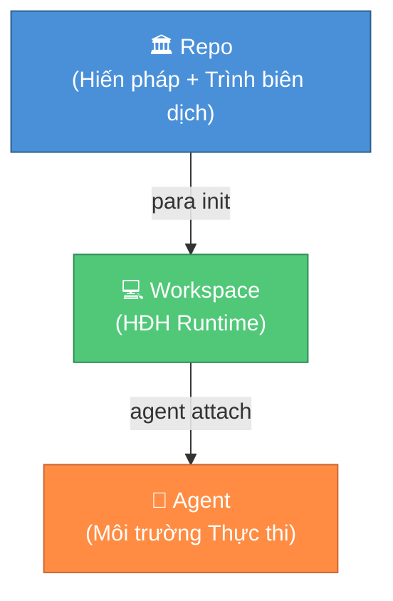
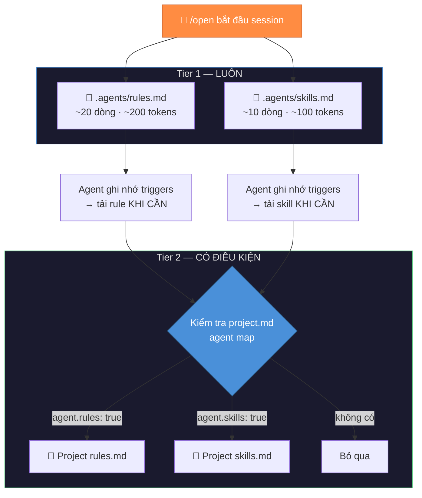
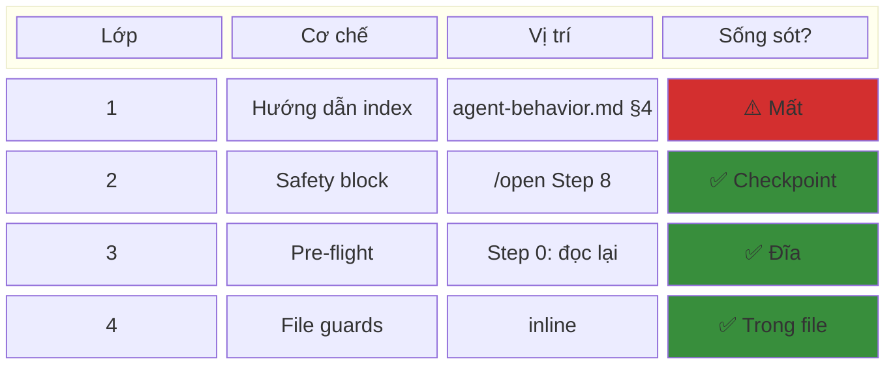
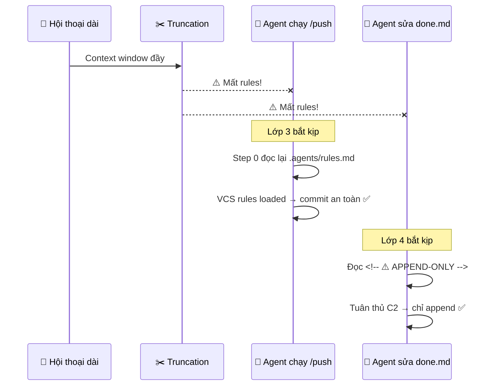
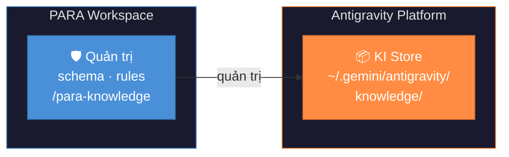
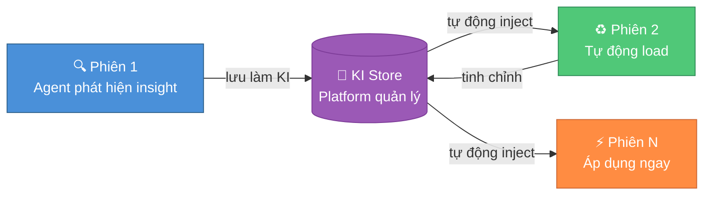

<div align="center">


# PARA Workspace

**Workspace Framework cho Con người & AI Agent**

[](https://opensource.org/licenses/MIT)
[](../../CHANGELOG.md)

[](https://antigravity.google/)

<a href="../../README.md"><b>🇺🇸 English</b></a> •
    <a href="./vi-VN.md"><b>🇻🇳 Tiếng Việt</b></a> •
    <a href="./zh-CN.md"><b>🇨🇳 中文</b></a> •
    <a href="./es-ES.md"><b>🇪🇸 Español</b></a> •
    <a href="./fr-FR.md"><b>🇫🇷 Français</b></a>

</div>

---

| Mục | Mô tả |
| :-- | :-- |
| [🌌 Tổng quan](#-tổng-quan) | Giới thiệu, ba nguyên tắc nền tảng |
| [📂 Kiến trúc](#-kiến-trúc) | Cấu trúc Repo + Workspace |
| [📥 Cài đặt](#-cài-đặt) | Yêu cầu, thiết lập, profiles |
| [🧠 Kernel](#-kernel-nhân-hệ-thống) | Invariants, heuristics, hợp đồng |
| [🛠️ CLI](#️-tham-chiếu-cli) | Tất cả lệnh CLI |
| [📑 Workflow Catalog](#-catalog-workflow) | 32 governed workflows |
| [🛡️ Rule Catalog](#️-rule-catalog) | 14 governance rules |
| [🧩 Skill Catalog](#-catalog-kỹ-năng-skills) | 21 reusable skills |
| [🔌 Hệ thống Công cụ](#-hệ-thống-công-cụ-v180) | Cài đặt plugin AI agentic ngoài |
| [🧩 Task Management](#-task-management-hybrid-3-file-model) | Hybrid 3-File model |
| [🔄 Nâng cấp](#-nâng-cấp-phiên-bản-upgrading) | Auto update + clean slate |
| [🗺️ Lộ trình](#️-lộ-trình) | Lịch sử version + kế hoạch |

## 🌌 Tổng quan

**PARA Workspace** là một workspace framework mã nguồn mở, định nghĩa cách con người và AI agent tổ chức tri thức và cộng tác trong dự án. Hệ thống được phân phối dưới dạng **repo** chứa kernel (hiến pháp), công cụ CLI, và templates — từ đó tạo ra các **workspace** nơi bạn thực sự làm việc. Kernel thực thi các invariants và heuristics để mọi workspace đều nhất quán, kiểm soát được, và thân thiện với agent.

### Ba Nguyên tắc Nền tảng

1. **Repo ≠ Workspace** — Repo chỉ chứa nội dung quản trị (kernel, CLI, templates). Không bao giờ chứa dữ liệu người dùng.
2. **Workspace = Runtime** — Được tạo bởi `para init`, mỗi workspace là một instance độc lập nơi bạn và agent làm việc.
3. **Kernel = Hiến pháp** — Các quy tắc bất biến mà mọi workspace phải tuân theo. Thay đổi yêu cầu RFC + nâng version.



---

## 📂 Kiến trúc

### Cấu trúc Repo (Repository này)

```
para-workspace/
├── .github/             # 🤖 CI/CD — validate-pr.yml, CODEOWNERS
├── rfcs/                # 📝 Quy trình RFC — TEMPLATE.md, status in header
├── kernel/              # 🧠 Hiến pháp
│   ├── KERNEL.md
│   ├── invariants.md    # 10 luật cứng (MAJOR bump)
│   ├── heuristics.md    # 10 quy ước mềm
│   ├── schema/          # workspace, project, backlog, catalog schemas
│   └── examples/        # Vector kiểm thử tuân thủ
├── cli/                 # 🔧 Trình biên dịch
│   ├── para             # Điểm vào (Tương thích Bash 3.2+)
│   ├── lib/             # logger.sh, validator.sh, rollback.sh, fs.sh
│   └── commands/        # init, scaffold, status, migrate, archive, install, update
├── templates/           # 📦 Khuôn mẫu & Thư viện Quản trị
│   ├── common/agents/    # Workflows/, rules/, skills/ tập trung + catalog.yml
│   │   └── projects/    # .project.yml template
│   └── profiles/        # Preset: dev, general
├── tests/               # 🧪 kernel/ + cli/ integration tests
├── docs/                # 📖 Tài liệu
│   ├── architecture/    # Kiến trúc: overview, kernel
│   ├── guides/          # Hướng dẫn: development, planning
│   ├── reference/       # Tra cứu: CLI, workflows, project-rules
│   ├── rules/           # Chi tiết từng Rule (11 files)
│   └── workflows/       # Chi tiết từng workflow (22 files)
├── CONTRIBUTING.md
├── VERSIONING.md
├── CHANGELOG.md
└── VERSION
```

### Cấu trúc Workspace (Tạo bởi `para init`)

Đây là hệ thống được sinh ra dành riêng cho cá nhân bạn.

```
<môi-trường-làm-việc>/
├── Projects/                          # Các nhiệm vụ có mục tiêu
│   ├── my-app/                        # Project chuẩn (type: standard)
│   │   ├── repo/                      #   Mã nguồn (git repo)
│   │   ├── artifacts/                 #   Plans, tasks, decisions
│   │   ├── sessions/                  #   Session logs
│   │   ├── docs/                      #   Tài liệu project
│   │   └── project.md                 #   Hợp đồng project
│   └── my-ecosystem/                  # Ecosystem project (type: ecosystem) — v1.6.0+
│       ├── artifacts/                 #   Cross-project plans & backlog
│       ├── sessions/                  #   Session logs
│       ├── docs/                      #   Chiến lược & tài liệu chung
│       └── project.md                 #   satellites: [app, api, ...], KHÔNG có repo/
├── Areas/                             # Các trách nhiệm thường xuyên (vd: sức khoẻ, tài chính)
│   ├── Workspace/                     # Session log tổng, audit reports, SYNC queue
│   └── Learning/                      # Mảng chia sẻ kiến thức (từ wf /learn)
├── Resources/                         # Tài liệu tham khảo và công cụ
│   ├── ai-agents/                     # Kernel snapshot + governed library snapshots
│   └── references/                    # Repo PARA chính thức (chỉ-đọc)
├── Archive/                           # Lưu trữ lạnh cho các dự án đã hoàn tất
├── _inbox/                            # Vùng đệm tạm thời để hứng dữ liệu ngoài tải về nhanh
├── .agents/                            # Thư viện hệ thống Governed Library (Tự động đồng bộ lên)
│   ├── rules.md                       # Workspace Rules Trigger Index (luôn được load)
│   ├── skills.md                      # Workspace Skills Trigger Index (v1.6.2+)
│   ├── rules/                         # Các quy tắc kỹ năng (.md) cho Agent
│   ├── skills/                        # Các kỹ năng phức hợp (.md, /scripts)
│   └── workflows/                     # Các luồng làm việc (.md) cho Agent
├── .para/                             # Trạng thái hệ thống ngầm (BẤT KHẢ XÂM PHẠM)
│   ├── archive/                       # Smart Archive — di dời file kiến trúc cũ
│   ├── migrations/                    # Lịch sử và kiểm soát luồng di chuyển phiên bản
│   ├── backups/                       # Bản sao lưu (workflows, projects, workspace sessions)
│   └── audit.log                      # Lịch sử hành động của PARA CLI
├── para                               # Bootstrapper CLI
└── .para-workspace.yml                # Metadata gốc quy định root config của hệ thống
```

---

## 📥 Cài đặt

### Yêu cầu

- **Một nền tảng AI Agent** (xem bảng tương thích bên dưới)
- **Git** (bắt buộc — để clone và cập nhật)
- **Bash** 3.2+ (Linux/macOS native, Windows qua Git Bash hoặc WSL)

### Tương thích Nền tảng

| Nền tảng | Điểm tích hợp | Trạng thái | Ghi chú |
| :-- | :-- | :-- | :-- |
| Google Antigravity | `.agents/` (skills, workflows) | ✅ Verified | Thiết kế và test chuyên cho nền tảng này |
| Claude Code | CLAUDE.md + `.agents/` | ⚪ Chưa kiểm chứng | Có thể đọc `.agents/rules/` — cần xác nhận |
| Cursor | `.cursor/rules/` | ⚪ Chưa test | Lý thuyết: copy rules sang `.cursor/rules/` |
| VS Code + Copilot | `.github/copilot-instructions` | ⚪ Chưa test | Lý thuyết: chỉ instructions, không auto-trigger |

### Bước 1: Clone & Cài đặt

**Bash (Linux / macOS / Windows Git Bash / WSL):**

```bash
# Clone repo vào đúng vị trí
mkdir -p Resources/references
git clone https://github.com/pageel/para-workspace.git Resources/references/para-workspace

# Cấp quyền thực thi
chmod +x Resources/references/para-workspace/cli/para
chmod +x Resources/references/para-workspace/cli/commands/*.sh

# Khởi tạo workspace với profile
./Resources/references/para-workspace/cli/para init --profile=dev --lang=vi
```

**PowerShell (tuỳ chọn thay thế cho Windows):**

```powershell
mkdir -Force Resources\references
git clone https://github.com/pageel/para-workspace.git Resources\references\para-workspace
# Sau đó mở Git Bash hoặc WSL tại workspace root:
./Resources/references/para-workspace/cli/para init --profile=dev --lang=vi
```

### Bước 2: Xác nhận

```bash
./para status
# ✅ Nếu thấy health report → cài thành công
```

> **Chuyện gì vừa xảy ra?**
>
> 1. Repo nằm tại `Resources/references/para-workspace/` — nguồn tham khảo quản trị, không phải project người dùng.
> 2. `chmod +x` đảm bảo các CLI scripts có quyền thực thi (bắt buộc trên Linux/macOS).
> 3. `para init` tạo cấu trúc thư mục PARA (bao gồm cả `_inbox/`), tự động chạy `install.sh`
>    để đồng bộ kernel, workflows, governance rules, và tạo wrapper `./para`.
> 4. Từ giờ bạn dùng `./para` từ workspace root cho mọi lệnh.

### Cập nhật

```bash
# Pull phiên bản mới nhất từ GitHub và đồng bộ lại workspace
./para update

# Xem trước thay đổi mà không áp dụng
./para update --dry-run
```

Lệnh này sẽ `git pull` repo, chạy migration phân tầng theo phiên bản (chỉ những bước cần thiết), và đồng bộ lại tất cả governed libraries. File tuỳ chỉnh được sao lưu thành `.bak` trước khi ghi đè (Smart Sync). Nếu install thất bại giữa chừng, tất cả thay đổi sẽ tự động rollback.

**Quy trình update:**

1. `git pull` tải code mới (tự restart nếu scripts thay đổi)
2. `migrate.sh` chạy migration phân tầng theo version (chỉ chạy gì cần)
3. `install.sh` đồng bộ kernel, workflows, rules, skills (với atomic rollback)
4. Ghi audit log vào `.para/audit.log`

### Xử lý sự cố

| Vấn đề | Giải pháp |
| :-- | :-- |
| **macOS: permission denied** | Chạy `chmod +x` cho CLI scripts (Bước 3 bên trên) |
| **Windows: file lock khi update** | Xem [Khôi phục Windows](#khôi-phục-windows) bên dưới |
| **Workspace quá cũ (v1.3.x)** | Dùng [Cơ chế 2: Làm mới Thủ công](#cơ-chế-2-dọn-dẹp-làm-mới-thủ-công-dành-cho-workspace-bị-chỉnh-sửa-mạnh) |

#### Khôi phục Windows

Nếu `para update` bị lỗi trên Windows do NTFS file locking:

```cmd
cd Resources\references\para-workspace
git checkout -- .
git pull origin main
cd ..\..\..
.\para install
```

### Profiles có sẵn

| Profile | Mô tả | Phù hợp cho |
| -- | -- | -- |
| [`general`](../../templates/profiles/general/README.md) | Cấu trúc PARA tối thiểu | PKM cá nhân |
| [`dev`](../../templates/profiles/dev/README.md) | Areas kỹ thuật + AI tooling | Lập trình viên |

### `para init` làm gì?

- ✅ Tạo `Projects/`, `Areas/`, `Resources/`, `Archive/`, và `_inbox/`
- ✅ Cấp **quyền thực thi** cho tất cả CLI scripts
- ✅ Tự động chạy **`install.sh`**, bao gồm:
  - Đồng bộ **governed workflows** từ `catalog.yml` vào `.agents/workflows/`
  - Đồng bộ **governed rules** từ `catalog.yml` vào `.agents/rules/`
  - Đồng bộ **workspace rules index** vào `.agents/rules.md` (trigger index)
  - Đồng bộ **skills** vào `.agents/skills/` (tuỳ profile)
  - Tạo **`./para`** wrapper tại workspace root
  - Sao lưu file xung đột thành `.bak`
- ✅ Tạo **`.para-workspace.yml`** với tracking phiên bản kernel
- ✅ Khởi tạo **`.para/`** (audit.log, migrations/, backups/) để kiểm soát đầy đủ

---

## 🧠 Kernel (Nhân hệ thống)

Kernel là **hiến pháp** của PARA Workspace — các quy tắc mà mọi workspace phải tuân theo.

### Invariants (Luật cứng — thay đổi = MAJOR bump)

| # | Quy tắc |
| -- | -- |
| I1 | Cấu trúc thư mục PARA là bắt buộc |
| I2 | Mô hình task hybrid 3-file (backlog = canonical, hot lane, /end sync) |
| I3 | Đặt tên project theo kebab-case |
| I4 | Không có task hoạt động = project không hoạt động |
| I5 | Areas không chứa runtime tasks |
| I6 | Archive là lưu trữ lạnh bất biến |
| I7 | Seeds là ý tưởng thô, không phải tasks |
| I8 | Không có file lẻ ở root workspace |
| I9 | Resources là tham chiếu chỉ-đọc |
| I10 | Tách biệt Repo ↔ Workspace |
| I11 | Ngôn ngữ viết workflow tuân thủ Language Compliance |

### Heuristics (Quy ước mềm — thay đổi = MINOR/PATCH)

| # | Hướng dẫn |
| -- | -- |
| H1 | Quy ước đặt tên (kebab-case, PascalCase) |
| H2 | Thứ tự ưu tiên nạp context |
| H3 | Quản lý phiên bản ngữ nghĩa (SemVer) |
| H4 | Cấu trúc thư mục project chuẩn |
| H5 | Vòng đời Beads (tạo → messy → tốt nghiệp) |
| H6 | Ranh giới VCS & Git |
| H7 | Tham chiếu xuyên project + Ecosystem + Meta-Project (v1.7.6) |
| H8 | Tương thích kernel cho workflow |
| H9 | Thư viện quản trị yêu cầu `catalog.yml` với `kernel_min` |
| H10 | Knowledge Items — schema, scope, slug validation (v1.7.0) |

### Hợp đồng Kernel ↔ Workspace

| File | Schema | Thực thi bởi |
| -- | -- | -- |
| `.para-workspace.yml` | `workspace.schema.json` | `para init`, `para status` |
| `Projects/*/.project.yml` | `project.schema.json` | `para scaffold`, `para review` |
| `artifacts/tasks/backlog.md` | `backlog.schema.json` | `para verify` |
| `*/catalog.yml` | `catalog.schema.json` | `para install`, `para update` |

---

## 🛠️ Tham chiếu CLI

```bash
# Lệnh Cốt lõi
para init [--profile] [--lang]  # Khởi tạo workspace
para status [--json]          # Sức khỏe hệ thống
para update [--dry-run]        # Cập nhật Hệ thống chuẩn hoá mới và di chuyển tự động (migrate)
para scaffold <loại> <tên>   # Tạo dự án/lĩnh vực/tài nguyên chuẩn với lõi tạo tác
para install [--force] [--dry-run]  # Đồng bộ thư viện hạt nhân và hệ thống quản trị từ repo
para archive <loại>/<tên>    # Chuyển các hạng mục hoàn tất vào thư mục Lưu trữ
para migrate [--from=X] [--to=Y]  # Tự động nâng cấp cấu trúc workspace theo phiên bản định kiến

# Cấu hình
para config [key] [value]     # Quản lý thiết lập trong tệp .para-workspace.yml

# Quản lý Công cụ (v1.8.0)
para install-tool <name>      # Cài đặt plugin từ registry
para remove-tool <name>       # Xoá plugin đã cài đặt
para list-tools               # Liệt kê plugin đã cài

# Chức năng của Agent
@[/para-workflow] list        # Kiểm tra và rà soát tính hợp quy của Workflows
@[/para-rule] list            # Kiểm tra và rà soát tính hợp quy của Rules
```

**Hỗ trợ nền tảng:** Linux, macOS (Bash 3.2+), Windows (Git Bash / WSL).

---

## 📑 Catalog Workflow

| Lệnh | Mô tả |
| :-- | :-- |
| **[`/backlog`](.../workflows/backlog.md)** | Quản lý tasks qua backlog.md canonical + plan integration |
| **[`/backup`](../workflows/backup.md)** | Sao lưu workflows, rules, config, và dữ liệu project |
| **[`/brainstorm`](../workflows/brainstorm.md)** | Brainstorm ý tưởng với cấu trúc và 5 hướng kế tiếp |
| **[`/para-config`](../workflows/para-config.md)** | Quản lý cấu hình workspace |
| **[`/end`](../workflows/end.md)** | Đóng phiên + dọn dẹp active_plan tự động |
| **[`/inbox`](../workflows/inbox.md)** | Phân loại file từ `_inbox/` vào PARA |
| **[`/install`](../workflows/install.md)** | Cài đặt thông minh (xử lý cập nhật/merge) |
| **[`/learn`](../workflows/learn.md)** | Ghi nhận bài học vào Areas/Learning |
| **[`/merge`](../workflows/merge.md)** | Merge ngữ nghĩa cho xung đột workflow |
| **[`/new-project`](../workflows/new-project.md)** | Khởi tạo project mới với scaffolding |
| **[`/open`](../workflows/open.md)** | Bắt đầu phiên với nạp context + plan phase |
| **[`/para`](../workflows/para.md)** | Bộ điều khiển chính cho quản lý workspace |
| **[`/docs`](../workflows/docs.md)** | Tạo, kiểm tra, và xuất bản tài liệu kỹ thuật |
| **[`/para-audit`](../workflows/para-audit.md)** | Khảo sát hệ thống, phát hiện độ lệch chuẩn so với Kernel |
| **[`/para-rule`](../workflows/para-rule.md)** | Quản lý, cài đặt, chuẩn hoá agent rules |
| **[`/para-workflow`](../workflows/para-workflow.md)** | Quản lý, cài đặt, chuẩn hoá agent workflows |
| **[`/plan`](../workflows/plan.md)** | Tạo, xem, và cập nhật kế hoạch triển khai |
| **[`/push`](../workflows/push.md)** | Commit và push nhanh lên GitHub |
| **[`/qa`](../workflows/qa.md)** | Vòng lặp kiểm tra chất lượng (QA) Red Team hệ thống cho các kế hoạch và tài liệu đặc tả |
| **[`/release`](../workflows/release.md)** | Kiểm tra chất lượng trước release |
| **[`/retro`](../workflows/retro.md)** | Retrospective project trước khi archive |
| **[`/spec`](../workflows/spec.md)** | Viết tài liệu đặc tả cấu trúc (có ranh giới và giả định) trước khi code |
| **[`/update`](../workflows/update.md)** | Cập nhật workspace an toàn với agent hỗ trợ |
| **[`/verify`](../workflows/verify.md)** | Xác minh hoàn thành task bằng walkthroughs |
| **[`/para-knowledge`](../workflows/para-knowledge.md)** | Quản lý Knowledge Items — dashboard, tạo, kiểm tra, lưu trữ |
| **[`/para-skill`](../workflows/para-skill.md)** | Co-Author engine tạo, kiểm tra và test AI Agent skills |
| **[`/write`](../workflows/write.md)** | Viết nội dung chuyên sâu với templates cấu trúc (Sidecar) |
| **[`/logs`](../workflows/logs.md)** | Phân tích session telemetry và ngân sách ngữ cảnh ngữ cảnh (context budget) |
| **[`/staging`](../workflows/staging.md)** | Đóng gói tài nguyên workspace vào repo của dự án (v1.8.11) |
| **[`/vibecode`](../workflows/vibecode.md)** | Quản lý chế độ thực thi tương tác/vòng lặp cho lập trình (v1.8.11) |
| **[`/scan-sec`](../workflows/scan-sec.md)** | Quét lỗ hổng bảo mật trong mã nguồn (v1.8.11) |
| **[`/resource`](../workflows/resource.md)** | Điều phối nhập tài nguyên, tạo đồ thị và học mẫu thiết kế (v1.8.11) |

---

## 🛡️ Catalog Quy tắc (Rules)

Rules chi phối hành vi, bảo mật và tuân thủ của Agent. Được tải theo yêu cầu qua cơ chế Two-Tier trigger index (~200 tokens). Xem [Rules & Context Loading](../reference/project-rules.md) cho cơ chế chi tiết.

| Quy tắc | Mô tả | Ưu tiên |
| :-- | :-- | :-- |
| **[`governance`](../rules/governance.md)** | Kernel invariants, scope containment, safety guardrails | 🔴 Critical |
| **[`vcs`](../rules/vcs.md)** | Git safety: commit, branch, merge, PR, secrets | 🔴 Critical |
| **[`knowledge`](../rules/knowledge.md)** | KI operations — write gate, approval, namespace (v1.7.0) | 🔴 Critical |
| **[`graph-first-policy`](../rules/graph-first-policy.md)** | Phân tích code qua đồ thị para-graph trước khi chỉnh sửa file | 🔴 Critical |
| **[`hybrid-3-file-integrity`](../rules/hybrid-3-file-integrity.md)** | 6 constraints (C1–C6) cho quản lý task | 🟡 Important |
| **[`agent-behavior`](../rules/agent-behavior.md)** | Proactive Trigger Check, Context Recovery (v1.6.2) | 🟡 Important |
| **[`context-rules`](../rules/context-rules.md)** | Agent Index Loading (rules + skills), Two-Tier trigger | 🟡 Important |
| **[`para-discipline`](../rules/para-discipline.md)** | PARA architecture compliance, 7 rules | 🟡 Important |
| **[`agent-persona`](../rules/agent-persona.md)** | Tính cách, tông giọng và phong cách giao tiếp của Agent | 🟡 Important |
| **[`artifact-standard`](../rules/artifact-standard.md)** | Plans, walkthroughs, persistent mirroring | 🟢 Standard |
| **[`naming`](../rules/naming.md)** | kebab-case, PascalCase, camelCase conventions | 🟢 Standard |
| **[`versioning`](../rules/versioning.md)** | SemVer, autonomy levels, multi-location sync | 🟢 Standard |
| **[`exports-data`](../rules/exports-data.md)** | Data export: `_inbox/`, UTF-8 BOM, naming | 🟢 Standard |
| **[`tool-routing`](../rules/tool-routing.md)** | Quy tắc định tuyến công cụ (Native API, Bash, MCP) | 🟢 Standard |

---

## 🧩 Catalog Kỹ năng (Skills)

Skills là các module kiến thức tái sử dụng, được load theo yêu cầu qua skills trigger index. Khác với rules (bắt buộc tuân thủ), skills cung cấp **templates, patterns và tài liệu tham chiếu**.

| Skill | Mô tả |
| :-- | :-- |
| **[PARA Kit](../skills/para-kit.md)** | Cấu trúc PARA workspace — schema, layout, kernel governance, intelligence routing |
| **[Formatting](../skills/formatting.md)** | Bảng, biểu đồ, tree listings, ASCII box art |
| **[Page Map](../skills/page-map.md)** | Quản lý cấu trúc visual website với PAGE_MAP.md và BLUEPRINT.md |
| **[PARA Skill](../skills/para-skill.md)** | Governance skill tạo, kiểm tra và test PARA skills qua Co-Author engine |
| **[Plan Templates](../skills/plan.md)** | Template Detail Plan & Roadmap (Sidecar, v1.7.8) |
| **[Docs Templates](../skills/docs.md)** | Template Architecture, CLI, Strategy (Sidecar, v1.7.8) |
| **[Brainstorm Templates](../skills/brainstorm.md)** | Template Decision & Research (Sidecar, v1.7.12) |
| **[Write Templates](../skills/write.md)** | Template các định dạng bài viết và quy tắc văn phong (Sidecar, v1.7.14) |
| **[Harness Guards](../skills/harness.md)** | Catalog guard và giao thức tự động quét để sinh cảnh báo an toàn theo ngữ cảnh (Sidecar, v1.7.16) |
| **[Spec Templates](../skills/spec.md)** | Template viết Spec, kiểm soát ranh giới và checklist chất lượng (Sidecar, v1.7.16) |
| **[QA Review Templates](../skills/qa.md)** | Các persona đóng vai Red Team, tiêu chí kiểm tra và template báo cáo QA (Sidecar, v1.8.6) |
| **[TDD Guidelines](../skills/tdd.md)** | Quy định nghiêm ngặt về Test-Driven Development, vòng lặp Red-Green-Refactor (v1.8.7) |
| **[Logs Audit Extensions](../skills/logs.md)** | Các template kiểm toán tuân thủ cho báo cáo TDD/Spec (Sidecar, v1.8.7) |
| **[HTML Renderer](../skills/html-renderer.md)** | Engine render HTML tĩnh cho tài liệu và đồ thị trực quan (v1.8.9) |
| **[New Project](../skills/new-project.md)** | Skill đồng hành cho workflow khởi tạo dự án /new-project (Sidecar, v1.8.10) |
| **[para-graph](../skills/para-graph.md)** | Định tuyến đồ thị thông minh và quản lý bộ nhớ ngữ nghĩa (Sidecar, v1.8.10) |
| **[Staging Templates](../skills/staging.md)** | Bản mẫu thiết lập ánh xạ đường dẫn tùy chỉnh để đóng gói tài nguyên (Sidecar, v1.8.11) |
| **[Vibecode Execution Templates](../skills/vibecode.md)** | Checklists xác minh và chế độ thực thi cho workflow vibecode (Sidecar, v1.8.11) |
| **[Vulnerability Scanner Templates](../skills/scan-sec.md)** | Quy tắc quét bảo mật, ánh xạ OWASP Top 10 và các bản mẫu báo cáo (Sidecar, v1.8.11) |
| **[Resource Study Templates](../skills/resource.md)** | Các bản mẫu nghiên cứu mẫu thiết kế và học hỏi tài nguyên (Sidecar, v1.8.11) |
| **[Sidecar Skill Governance](../skills/sidecar-skill.md)** | Quy chuẩn cấu trúc và quy tắc cho việc viết Sidecar Skills để bổ trợ workflows (v1.8.11) |

---

## 🏗️ Kiến trúc Rule — Two-Tier Loading & Defense-in-Depth

Rules không bị nhồi nhét vào context cùng lúc. PARA Workspace sử dụng kiến trúc **progressive disclosure** — tải rule theo yêu cầu, tiết kiệm ~90% token budget mà vẫn đảm bảo tuân thủ đầy đủ.

### Cách hoạt động: Two-Tier Trigger Index



> 💡 **Tổng chi phí: ~350 tokens** (so với ~2,000 nếu tải hết)

### Defense-in-Depth: 4 Lớp Bảo vệ

Sau cuộc hội thoại dài, AI agent mất context (truncation). PARA Workspace có **4 lớp độc lập** đảm bảo rules và skills luôn sống sót:



Lớp 3 sử dụng **Proactive Trigger Check** (v1.6.2): TRƯỚC mọi side-effect, agent scan toàn bộ trigger tables và load rules/skills phù hợp TRƯỚC.

Lớp 4 hỗ trợ **6 loại guard**: `STATUS GATE`, `MANDATORY`, `HARNESS GUARD`, `FILE GUARD` (C1-C3, I9, GOVERNED), `WORKFLOW GATE`, `CONTEXT RECOVERY`.

**Kịch bản: Agent quên rules sau truncation**



> 📖 Chi tiết kiến trúc: [Context Recovery](../architecture/context-recovery.md) · [Defense-in-Depth](../architecture/defense-in-depth.md) · [Rule Layers](../architecture/rule-layers.md)

---

## 🧩 Quản lý Tác vụ (Mô hình Hybrid 3-File)

PARA Workspace giải quyết bài toán "Lãng phí Token & Mất trí nhớ" của AI Agent thông qua kiến trúc **Hybrid 3-File Model** (v1.5.3: Hot Lane).

Thay vì bắt Agent phải đọc một file backlog khổng lồ, công việc được phân bổ qua ba tệp tin chuyên biệt:

```
artifacts/tasks/
├── backlog.md          # 📌 OPERATIONAL AUTHORITY — Nguồn sự thật duy nhất cho task chiến lược.
├── sprint-current.md   # 🔥 HOT LANE — Buffer ghi trực tiếp cho Agent (quick tasks phát sinh).
└── done.md             # ✅ ARCHIVE — Lưu trữ append-only với origin tags (#backlog / #session).
```

### Cơ chế hoạt động

1. **Backlog Summary** — `/open` chỉ đọc bảng Summary (~10 dòng) + top items qua `grep`. Không bao giờ đọc toàn bộ file.
2. **Hot Lane** — Agent ghi quick tasks (`- [ ] Fix CSS`) vào `sprint-current.md` và tick `[x]` khi xong. Task chiến lược từ backlog được đọc trực tiếp, không copy.
3. **`/end` là Sync Point duy nhất** — Khi đóng phiên, `/end` chạy Hot Lane Sync:
   - Quick `[x]` → `done.md` (tag `#session`)
   - Quick `[ ]` → hỏi user: giữ hay promote vào backlog?
   - **Smart Suggest** → đọc session log, tìm task IDs được nhắc đến, gợi ý đánh dấu Done (tag `#backlog`)
4. **Zero Ceremony khi code** — Không cần `/backlog update` giữa phiên. Cứ code thôi.
5. **`/backlog clean` = Nén, Không Xoá** — Done items được nén thành 1 dòng/plan trong section `✅ Completed` của backlog. Chi tiết nằm ở `done.md` (nhóm theo plan, link sang `plans/done/`). Chuỗi tra cứu: `backlog → done.md → plans/done/`.

---

## 📚 Hệ thống Kiến thức (v1.7.0)

AI agent mất context giữa các phiên làm việc. **Knowledge Items (KIs)** là tính năng cốt lõi của [Google Antigravity](https://antigravity.google/docs/knowledge) — nền tảng AI coding agent — cung cấp bộ nhớ bền vững xuyên phiên, xuyên dự án và xuyên cuộc hội thoại.

KIs nằm **bên ngoài** workspace, trong KI Store do Antigravity quản lý (`~/.gemini/antigravity/knowledge/`). Điều này phản ánh nguyên tắc nền tảng của PARA Workspace: cũng như **repo quản trị nhưng không chứa** dữ liệu người dùng, PARA Workspace **quản trị các thao tác KI** (schema, rules, lifecycle workflows) mà không sở hữu tầng lưu trữ.



### Cách hoạt động



Khác với session logs (mất sau truncation) hay learning files (giới hạn project), KIs:

- **Tự động inject** vào đầu phiên bởi platform
- **Xuyên project** — KIs scope workspace áp dụng cho mọi project
- **Sẵn sàng cho Knowledge Graph** — taxonomy domain × purpose

### Phân loại KI

Mỗi KI được phân loại theo hai trục — **domain** (chủ đề) × **purpose** (mục đích):

```
                  ┌────────────────────────────────────────────────────────┐
                  │                     MỤC ĐÍCH                           │
                  ├──────────────┬──────────────┬─────────────┬────────────┤
                  │   context    │  reference   │   pitfall   │  playbook  │
                  │  (priming)   │  (tra cứu)   │  (cạm bẫy)  │ (quy trình)│
     ┌────────────┼──────────────┼──────────────┼─────────────┼────────────┤
     │ workspace  │ PARA arch    │ kernel specs │ update bugs │ audit proc │
     │ engineering│ tech stack   │ API docs     │ dep gotchas │ deploy SOP │
  C  │ operations │ infra setup  │ CI/CD ref    │ env traps   │ rollback   │
  H  │ content    │ writing std  │ style guide  │ SEO traps   │ publish    │
  Ủ  │ strategy   │ org context  │ roadmap      │ scope creep │ planning   │
     │ ...        │              │              │             │            │
  Đ  ├────────────┘              │              │             │            │
  Ề  │  (mở — tự định nghĩa)     │              │             │            │
     └───────────────────────────┴──────────────┴─────────────┴────────────┘
```

> **Domain** là chuỗi mở — tự định nghĩa domain tùy nhu cầu.
> **Purpose** là enum cố định: `context`, `reference`, `pitfall`, `playbook`.

### Vòng đời & Tích hợp

| Workflow | Tích hợp KI |
| :-- | :-- |
| `/open` | KI context từ platform, khớp scope cho báo cáo |
| `/plan` | Pitfall KIs → Risks, Playbook KIs → Phase references |
| `/end` | Gợi ý tạo/cập nhật KI từ insights phiên làm việc |
| `/brainstorm` | Option F: Trích xuất insight thành KI |
| `/retro` | Tốt nghiệp cross-project patterns thành KIs |
| `/para-knowledge` | Vòng đời đầy đủ: tạo, cập nhật, kiểm tra, lưu trữ |

### Quản trị

KI operations được chi phối bởi **7 quy tắc (KR1–KR7)** và xác thực theo **H10** (11 điều khoản):

- **KR1 Write Gate**: Chỉ `/para-knowledge` workflow mới được tạo/sửa KI
- **KR2 User Approval**: Mọi KI đều cần sự xác nhận của người dùng
- **KR3 Namespace**: Tiền tố `para_` dành riêng cho system KIs
- **KR5 Recoverability**: Mọi thao tác KI đều có thể hoàn tác
- **KR7 Ephemeral Ban**: Cấm tham chiếu file tạm trong KI references (v1.7.5)

> 📖 Schema: [`ki.schema.json`](../../kernel/schema/ki.schema.json) · Quản trị: [`heuristics.md` H10](../../kernel/heuristics.md)

---

## 🔌 Hệ thống Công cụ (v1.8.0)

PARA Workspace hỗ trợ một **Hệ thống Công cụ Động** có thể mở rộng, cho phép cài đặt các plugin ngoại vi độc lập ngôn ngữ (ví dụ: `para-graph`) trực tiếp vào workspace.

Các công cụ được quản lý qua một registry trung tâm (`registry/tools.yml`) và cài đặt dạng tarball độc lập.

### Cách thức hoạt động
1. **Không phụ thuộc Toàn cục**: Tools được cài cục bộ vào `.para/tools/` để cách ly hoàn toàn.
2. **Hỗ trợ Đa môi trường (Multi-Runtime)**: CLI tự động tạo wrapper scripts (vd: `repo/cli/commands/graph.sh`) để điều hướng gọi Node, Python, hoặc file thực thi nhị phân.
3. **Dev/Prod Fallback**: Nếu mã nguồn công cụ nằm sẵn trong workspace (chế độ Dev), wrapper sẽ ưu tiên chạy nó. Nếu không, fallback về tarball đã giải nén (chế độ Prod).

### Công cụ khả dụng

| Công cụ | Phiên bản | Mô tả |
| :--- | :--- | :--- |
| **[`para-graph`](https://github.com/pageel/para-graph)** | Đồ thị Tri thức Code lai ghép (Hybrid Code-Knowledge Graph) cho PARA Workspace |

### Cách sử dụng

```bash
# Cài đặt plugin para-graph (phân tích code cấu trúc & MCP server)
./para install-tool para-graph

# Liệt kê các plugin đã cài đặt
./para list-tools

# Chạy công cụ
./para graph --help

# Xóa công cụ
./para remove-tool para-graph
```

### Tool Intelligence Installer (v1.8.1)

Các công cụ có thể đóng gói trực tiếp trí thông minh AI (workflows, skills, rules) vào file `tool.manifest.yml`:

```yaml
agents:
  workflows:
    - source: templates/agents/workflows/para-graph.md
      target: para-graph.md
      version: "1.8.0"
  skills:
    - source: templates/agents/skills/graph-enrichment/
      target: graph-enrichment/
      version: "1.0.0"
```

Khi bạn chạy `./para install-tool <name>`, CLI sẽ tự động phân tích manifest này và hỏi bạn có muốn cài đặt phần thông minh đi kèm không. 
Bạn có thể dùng cờ `--agents` để chỉ cài phần agent, hoặc `--no-agents` để bỏ qua câu hỏi.
Lệnh `remove-tool` cũng sẽ tự động hỏi để dọn dẹp các agent liên quan mà nó đã cài.

---

## 🔄 Nâng cấp Phiên bản (Upgrading)

> 📖 **Lưu ý:** Để xem chi tiết các tính năng mới, lỗi được sửa và thông tin cập nhật từng phiên bản, vui lòng tham khảo [CHANGELOG](../../CHANGELOG.md).

PARA Workspace cung cấp hai cơ chế chính thức để nâng cấp lên phiên bản mới hơn:

### Cơ chế 1: Cập nhật Tự động (Khuyên dùng)

Dành cho đa số cấu trúc workspace đang khỏe mạnh, cơ chế cập nhật tích hợp sẽ xử lý mọi thứ an toàn.

```bash
./para update
```

Lệnh này sẽ tự động tải lõi hệ thống mới về, chạy migration phân tầng (chỉ chạy những bước phù hợp phiên bản), đồng bộ thư viện, và di dời file hệ thống lỗi thời vào `.para/archive/` mà không xoá dữ liệu riêng của bạn (Smart Archive). Các rules tuỳ chỉnh được bảo vệ bằng `.bak` backup.

### Cơ chế 2: Dọn dẹp Làm mới Thủ công (Dành cho workspace bị chỉnh sửa mạnh)

Nếu workspace của bạn quá cũ (v1.3.x) hoặc đã bị bạn chỉnh sửa cấu trúc lõi nghiêm trọng, hãy làm mới hoàn toàn:

1. Chạy `para init --profile=dev --lang=vi` ở một không gian thư mục hoàn toàn mới.
2. Sao chép lại các thư mục `Projects/` bên dự án cũ rớt vào thư mục `_inbox/` ở workspace mới.
3. Chạy workflow `/inbox` hoặc dùng AI agent để tự động phân luồng dọn dẹp các project về đúng khoang chứa chuẩn mới của PARA.

---

## 🗺️ Lộ trình

- [x] Cross-Project Sync Queue _(phát hành v1.3.6)_
- [x] Trích xuất Kernel & Tái cấu trúc Repo _(phát hành v1.4.0)_
- [x] Thư viện Quản trị, Quy trình RFC, An toàn Workspace Runtime _(phát hành v1.4.1)_
- [x] Landing Page `paraworkspace.dev` _(phát hành v1.4.1)_
- [x] Workflow Plan-Aware & Tối ưu Token _(phát hành v1.4.2)_
- [x] Tự động dọn dẹp Plan qua `/end [done]` _(phát hành v1.4.3)_
- [x] Safety Guardrails & Terminal Allowlist _(phát hành v1.4.5)_
- [x] Smart Archive & Version Migration _(phát hành v1.4.6)_
- [x] Tương thích macOS & Pipeline Migration an toàn _(phát hành v1.4.7)_
- [x] Atomic Rollback, Dry-run Pipeline & README Rewrite _(phát hành v1.4.8)_
- [x] Centralized Backup & Workspace Cleanup _(phát hành v1.4.9)_
- [x] Documentation Manager Workflow _(phát hành v1.4.10)_
- [x] Project Rules Loading & Safe Update Workflow _(phát hành v1.5.0)_
- [x] Hybrid 3-File Integrity, Working Checkmarks & Docs Overhaul _(phát hành v1.5.2)_
- [x] Hot Lane Refactor, /end Sync Point & Token Optimization _(phát hành v1.5.3)_
- [x] Context Recovery, Workflow Pre-flight & Defense-in-Depth _(phát hành v1.5.4)_
- [x] Meta-Project & Ecosystem Support _(phát hành v1.6.0)_
- [x] Unified Strategy → Plan Flow _(phát hành v1.6.1)_
- [x] Unified Agent Index — Skills Loading & Proactive Trigger Check _(phát hành v1.6.2)_
- [x] Central Gate — project.md là nguồn duy nhất cho context loading _(phát hành v1.6.3)_
- [x] Para-Kit Skill v1.1.0, Recursive Sync & Git Hash Detection _(phát hành v1.6.4)_
- [x] Update Flow Fix — Phát hiện hướng version, Migration History _(phát hành v1.6.5)_
- [x] **Knowledge System — KI schema, /para-knowledge workflow, graph-ready taxonomy** _(phát hành v1.7.0)_
- [x] **System KI Governed Lifecycle — namespace guard, template sync, CLI hooks** _(phát hành v1.7.1)_
- [x] **KI Index Schema Upgrade, Workflow Simplification & Knowledge Graph Seed** _(phát hành v1.7.2)_
- [x] **Agent Path Convention Fix (BUG-28) & Rule Frontmatter** _(phát hành v1.7.3)_
- [x] **Repo Path Standardization, Pending TODO Fix & Project Profile Skill** _(phát hành v1.7.4)_
- [x] **KR7 Ephemeral Ban & /knowledge → /para-knowledge Rename** _(phát hành v1.7.5)_
- [x] **Skill Catalog Architecture & Meta-Project Type** _(phát hành v1.7.6)_
- [x] **Brainstorm Consolidation, Sidecar Skill & /docs** _(phát hành v1.7.7-1.7.8)_
- [x] **Proactive Trigger Check & Cognitive Bypass Fix** _(phát hành v1.7.9-1.7.10)_
- [x] **Backlog Governance & Extract Paradigm** _(phát hành v1.7.11-1.7.12)_
- [x] **VERSIONS.yml Migration & Anti-Token Decay** _(phát hành v1.7.13)_
- [x] **Content Authoring Ecosystem & Session Telemetry** _(phát hành v1.7.14)_
- [x] **Harness Skill, Plan Status Gate & Roadmap Prefix Convention** _(phát hành v1.7.15)_
- [x] **Spec Workflow, Dual-Format Guards & CLI Fixes** _(phát hành v1.7.16)_
- [x] **Dynamic Tool System & tích hợp para-graph** _(phát hành v1.8.0)_
- [x] **Tool Intelligence Installer & trí tuệ AI khai báo qua manifest** _(phát hành v1.8.1)_
- [x] **MCP Auto-Setup — lệnh CLI `mcp-setup`, `mcp-list`, `mcp-remove`** _(phát hành v1.8.2)_
- [x] **Tích hợp Para-Graph MCP trên toàn hệ sinh thái — vòng đời bộ nhớ, Skill Sidecar, độ phủ 43% workflow** _(phát hành v1.8.9)_
- [x] **Đóng gói Phát hành, tích hợp HTML Renderer, Quy tắc Spec & TDD Gate** _(phát hành v1.8.10)_
- [x] **Đóng gói Phát hành: logic dirty-check ghi đè template trong install-tool CLI, phát hiện khác biệt xung đột, tích hợp các workflow staging/scan-sec/vibecode/resource** _(phát hành v1.8.11)_
- [x] **Di trú MCP Config cho Antigravity IDE 2.x & v1.x & Tích hợp TDD** _(phát hành v1.8.12)_
- [x] **Giải quyết Node Path Resolution (NVM/fnm/Volta) & Cải tiến Rule/KI Artifact Authority** _(phát hành v1.8.13)_
- [x] **Chuyển đổi đường dẫn Windows MCP (BUG-37) & Tự động kích hoạt Kế hoạch** _(phát hành v1.8.14)_
- [x] **Vibecode DSP & Hợp nhất Bản mẫu** _(phát hành v1.8.15)_
- [ ] Department System _(v1.9.0 — lên kế hoạch)_
- [ ] Community & Trust Boundary _(v1.10.0 — lên kế hoạch)_

---

## 🤝 Đóng góp

Xem [CONTRIBUTING.md](../../CONTRIBUTING.md) để biết hướng dẫn. Điểm chính:

- Thay đổi invariant kernel yêu cầu **RFC + MAJOR bump** → Xem [rfcs/TEMPLATE.md](../../rfcs/TEMPLATE.md)
- Thay đổi heuristic yêu cầu **PR + MINOR/PATCH bump**
- Mọi thay đổi phải vượt qua test vectors trong `kernel/examples/`

---

## 📄 Bản quyền & Tham chiếu

Dự án này được cấp phép theo Giấy phép MIT.

Phân hệ quét và rà soát bảo mật `/scan-sec` (được quản lý theo quy định tại [scan-sec SKILL.md](../../templates/common/agents/skills/scan-sec/SKILL.md)) được xây dựng dựa trên và tham khảo từ 2 nguồn:
- [Repository vbsec](https://github.com/tanviet12/vbsec) (kiến trúc thực thi cốt lõi).
- [Dự án OWASP Top 10](https://owasp.org/www-project-top-ten/) (các tiêu chuẩn và phân loại bảo mật).

### Thư viện & Công cụ bên thứ ba

#### Công cụ CLI cốt lõi
- [jq](https://jqlang.github.io/jq/) (Bộ xử lý cấu trúc JSON dòng lệnh, dùng cho cập nhật cấu hình).
- [Git](https://git-scm.com/) (Yêu cầu cho quản lý phiên bản và cập nhật workspace).
- [Node.js](https://nodejs.org/) (Môi trường thực thi cho phân tích đồ thị code và trình kết xuất tài liệu HTML).

#### Thư viện CDN Frontend (dùng trong kết xuất HTML)
- [marked](https://github.com/markedjs/marked) (Trình biên dịch Markdown).
- [mermaid](https://github.com/mermaid-js/mermaid) (Công cụ vẽ sơ đồ/đồ thị).
- [force-graph](https://github.com/vasturiano/force-graph) (Công cụ kết xuất đồ thị lực 2D cho trực quan hóa đồ thị code).
- [lucide](https://github.com/lucide-icons/lucide) (Thư viện icon giao diện).
- [Google Fonts](https://fonts.google.com/) (Phông chữ Inter, Outfit, Roboto, Fira Code).

---

Xây dựng với ❤️ bởi **Pageel**. Chuẩn hoá tương lai của PKM Agent.

_Phiên bản: 1.8.16_
