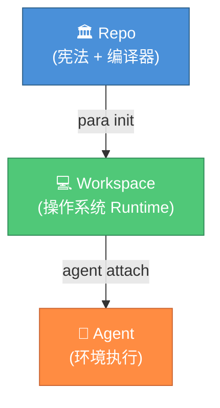

<div align="center">


# PARA Workspace

**人类与 AI Agent 的工作空间框架**

[](https://opensource.org/licenses/MIT)
[](../../CHANGELOG.md)

[](https://antigravity.google/)

<a href="../../README.md"><b>🇺🇸 English</b></a> •
    <a href="./vi-VN.md"><b>🇻🇳 Tiếng Việt</b></a> •
    <a href="./zh-CN.md"><b>🇨🇳 中文</b></a> •
    <a href="./es-ES.md"><b>🇪🇸 Español</b></a> •
    <a href="./fr-FR.md"><b>🇫🇷 Français</b></a>

</div>

---

| 章节 | 说明 |
| :--- | :--- |
| [🌌 概述](#-概述) | 什么是 PARA Workspace，三大基础原则 |
| [📂 架构](#-架构) | 仓库结构 + 生成的工作空间结构 |
| [📥 安装](#-安装) | 先决条件、设置、配置文件、故障排除 |
| [🧠 内核](#-内核) | 不变原则、启发式规则、契约 |
| [🛠️ CLI 参考](#-cli-参考) | 所有 CLI 命令 |
| [📑 工作流目录](#-工作流目录) | 24 个受治理的工作流 |
| [🛡️ 规则目录](#-规则目录) | 11 条治理规则 |
| [🧩 技能目录](#-技能目录) | 3 个可复用技能 |
| [🧩 任务管理](#-任务管理混合-3-文件模型) | 混合 3-文件模型 |
| [🔄 升级](#-升级版本) | 自动更新 + 全新安装 |
| [🗺️ 路线图](#-路线图) | 版本历史 + 计划中的功能 |

## 🌌 概述

**PARA Workspace** 是一个开源工作空间框架，定义了人类和 AI Agent 如何组织知识并协作完成项目。它以 **代码仓库(repo)** 的形式分发，包含内核（宪法）、CLI 工具和模板 —— 并据此生成您实际进行工作的 **工作空间(workspace)**。内核强制执行各项不变原则和启发式规则，使每个工作空间都具有可预测性、可审计性且对 AI Agent 友好。

### 三大基础原则

1. **Repo ≠ Workspace（仓库 ≠ 工作空间）** — 仓库仅包含治理内容（内核、CLI、模板），不包含任何用户数据。
2. **Workspace = Runtime（工作空间 = 运行时）** — 由 `para init` 生成，每个工作空间是一个独立的实例，您与您的 Agent 在其中协同工作。
3. **Kernel = Constitution（内核 = 宪法）** — 所有工作空间必须遵循的不可变规则。对规则的更改需要通过 RFC 提案 + 升级版本号。



---

## 📂 架构

### 仓库结构 (本仓库)

```
para-workspace/
├── .github/             # 🤖 CI/CD — validate-pr.yml, CODEOWNERS
├── rfcs/                # 📝 RFC 提案流程 — TEMPLATE.md
├── kernel/              # 🧠 宪法 (Constitution)
│   ├── KERNEL.md
│   ├── invariants.md    # 11条硬性规则 (修改需升 MAJOR 版)
│   ├── heuristics.md    # 10条软性约定
│   ├── schema/          # workspace, project, backlog 等的 JSON Schema
│   └── examples/        # 有效/无效的合规模板示例
├── cli/                 # 🔧 编译器 (Compiler)
│   ├── para             # 入口脚本 (兼容 Bash 3.2+)
│   ├── lib/             # 核心库 logger, validator, rollback 等
│   └── commands/        # init, scaffold, status, migrate, install 等命令
├── templates/           # 📦 脚手架与受治理库
│   ├── common/agents/   # 工作流, 规则, 技能 及 catalog.yml
│   │   └── projects/    # .project.yml 模板
│   └── profiles/        # dev, general 预设配置
├── tests/               # 🧪 kernel/ 与 cli/ 的集成测试
├── docs/                # 📖 文档
├── CONTRIBUTING.md
├── VERSIONING.md
├── CHANGELOG.md
└── VERSION
```

### 工作空间结构 (由 `para init` 生成)

```
<your-workspace>/
├── Projects/                          # 以目标为导向的任务
│   ├── my-app/                        # 标准项目 (type: standard)
│   │   ├── repo/                      #   源代码 (git 仓库)
│   │   ├── artifacts/                 #   计划, 任务, 决策记录
│   │   ├── sessions/                  #   会话日志
│   │   ├── docs/                      #   项目文档
│   │   └── project.md                 #   项目契约
│   └── my-ecosystem/                  # 生态系统项目 (type: ecosystem)
│       ├── artifacts/                 #   跨项目计划与待办事项
│       └── project.md                 #   satellites: [app, api, ...], 无 repo/
├── Areas/                             # 持续的责任领域 (如: 健康, 财务)
│   ├── Workspace/                     # 主会话日志、审计、SYNC 队列
│   └── Learning/                      # 共享知识库 (通过 /learn)
├── Resources/                         # 参考资料与工具
│   ├── ai-agents/                     # 内核快照与受治理库快照
│   └── references/                    # 原始 PARA 仓库 (只读)
├── Archive/                           # 已完成项目的冷存储
├── _inbox/                            # 外部下载的临时停靠区
├── .agents/                           # 受治理库的副本 (自动同步)
│   ├── rules.md                       # 规则触发索引表
│   ├── skills.md                      # 技能触发索引表
│   ├── rules/                         # 活跃的 agent 规则
│   ├── skills/                        # 活跃的 agent 技能
│   └── workflows/                     # 活跃的 agent 工作流
├── .para/                             # 系统状态 (请勿编辑)
│   ├── archive/                       # 智能归档库
│   ├── backups/                       # 日期标记的备份
│   └── audit.log                      # 操作历史审计
├── para                               # CLI 脚本程序
└── .para-workspace.yml                # 工作空间根元数据配置
```

---

## 📥 安装

### 先决条件

- **AI Agent 平台** (见下表)
- **Git** (克隆和更新所必需)
- **Bash** 3.2+ (Linux/macOS 原生支持, Windows 使用 Git Bash 或 WSL)

### 步骤 1: 克隆与安装

```bash
# 将仓库克隆到正确位置
mkdir -p Resources/references
git clone https://github.com/pageel/para-workspace.git Resources/references/para-workspace

# 赋予执行权限
chmod +x Resources/references/para-workspace/cli/para
chmod +x Resources/references/para-workspace/cli/commands/*.sh

# 使用预设配置初始化工作空间
./Resources/references/para-workspace/cli/para init --profile=dev --lang=en
```

### 步骤 2: 验证

```bash
./para status
# ✅ 如果看到健康报告，则说明安装成功
```

### 更新机制

```bash
# 从 GitHub 拉取最新代码并重新同步工作空间
./para update

# 在应用之前预览变更
./para update --dry-run
```

---

## 🧠 内核

内核是 PARA Workspace 的 **宪法** —— 所有工作空间必须遵守的规则。

### 不变原则 (Invariants)

11条硬性规则（修改需要 MAJOR 重大版本升级），例如 `I1` (强制目录结构), `I2` (混合 3 文件任务模型), `I10` (库与工作空间分离) 等。

### 启发式规则 (Heuristics)

10条软性约定（修改需要 MINOR/PATCH 升级），涵盖命名规范、上下文加载优先级、知识项（KI）管理等。

---

## 🛠️ CLI 参考

```bash
# 核心命令
para init [--profile] [--lang]  # 创建工作空间
para status [--json]            # 系统健康检查
para update                     # 自动更新与迁移
para scaffold <type> <name>     # 创建结构化路径
para install [--force]          # 同步受治理库
para archive <type> <name>      # 毕业审查与归档
para migrate [--from] [--to]    # 工作空间迁移

# Agent 管理
@[/para-workflow] list          # 管理工作流
@[/para-rule] list              # 管理规则
```

---

## 📑 工作流目录

内置 24 个受治理核心工作流（如 `/plan`, `/backlog`, `/open`, `/end`, `/para-knowledge`, `/para-skill` 等）用于规范化 AI Agent 在项目内的操作流。

## 🛡️ 规则目录

包含 11 条治理规则，通过双层触发索引进行按需加载以节省 Token。包括 `governance` (核心), `vcs` (Git 安全), `knowledge` (KI 操作安全), 及 `hybrid-3-file-integrity` 等。

## 🧩 技能目录

目前包含 3 个复用技能（`PARA Kit`, `Formatting`, `Page Map`），按需加载并提供模板、模式和参考资料。

---

## 🏗️ 规则架构 — 双层加载与深度防御

PARA Workspace 采用 **渐进式披露 (Progressive Disclosure)** 架构，仅通过查阅 `rules.md` 和 `skills.md` 索引表（~200 token）来按需加载大型规则，能够为您节省约 90% 的 Context 代价。

系统具备 **4 层防御 (Defense-in-Depth)** 系统：
1. 规则索引表
2. 会话检查点
3. Step 0 请求前重新加载
4. 内联文件拦截 Guard `<!-- ⚠️ APPEND-ONLY -->`

---

## 🧩 任务管理 (混合 3-文件模型)

解决 AI "记忆衰退 (Amnesia)" 问题，将庞大的系统分摊至 3 个文件：
- `backlog.md` (战略总任务池)
- `sprint-current.md` (当前冲刺热通道，Agent 高频读写)
- `done.md` (只追加模式下的完成记录)

通过 `/end` 指令在每天（或每次会话）结束时进行状态压缩与同步清理。

---

## 📚 知识系统 (v1.7.0)

引入 Knowledge Items (KIs)，将经验通过 `/para-knowledge` 打包为不受制于 Session 生命周期和项目边界的跨空间共享知识块。与 Antigravity AI 平台原生集成以实现自动注入加载。

---

## 🔄 升级版本

支持 `./para update` 实现从上游源库提取最新架构，并在保留用户自定义（备份为 `.bak`）的前提下实施热更新。

---

## 🗺️ 路线图

当前版本为 **1.7.6** (Skill Catalog 架构更新)。
未来规划包含 **v1.8.0** (Department 系统) 及 **v1.9.0** (社区与信任边界)。

---

## 🤝 贡献

请参阅 [CONTRIBUTING.md](../../CONTRIBUTING.md) 了解详细指南。所有针对内核原则的更改都需要通过 RFC 审核流程。

---

用 ❤️ 构建，由 **Pageel** 出品。标准化 Agent PKM 的未来。

_版本: 1.7.6_
