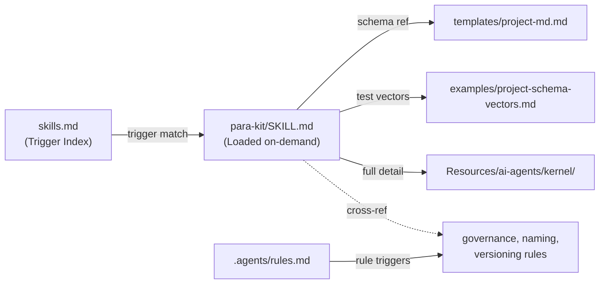

# Para-Kit Skill — Documentation

> **Skill version:** v1.1.0 | **Kernel compatibility:** ≥ 1.4

## Overview

**Para-Kit** is the only skill shipped by default in every PARA Workspace. It provides AI agents with a "structure map" to understand workspace layout, project.md schema, and kernel governance — without reading the full kernel (saving ~3000 tokens).

### When is the skill loaded?

Para-Kit is triggered via `.agents/skills.md` when the agent needs to:

| Trigger | Example operations |
| :-- | :-- |
| Create/modify project structure | `para scaffold project`, `/new-project` |
| Read project.md schema | `/open`, `/plan`, `/para-audit` |
| Check invariants/heuristics | `/verify`, `/release`, `/para-audit` |
| Create files at correct PARA locations | `/inbox`, `/learn`, any file creation |

### Loading cost

| Component | Tokens (est.) | Loaded when |
| :-- | :--: | :-- |
| SKILL.md | ~800 | On-demand (trigger match) |
| templates/project-md.md | ~200 | Only when creating new projects |
| examples/project-schema-vectors.md | ~300 | Only when validating schema |
| **Total maximum** | **~1300** | (rarely loaded together) |

Compare: Reading full kernel (`KERNEL.md` + `invariants.md` + `heuristics.md`) costs ~3000 tokens.

---

## File Structure

```
.agents/skills/para-kit/
├── SKILL.md                           # Main doc — structure reference + QRC
├── templates/
│   └── project-md.md                  # Full project.md template (all fields v1.6.3)
└── examples/
    └── project-schema-vectors.md      # Test vectors for schema validation
```

### Source and Sync

| Location | Role | Updated by |
| :-- | :-- | :-- |
| `repo/templates/common/agents/skills/para-kit/` | Source of Truth | Developer (git push) |
| `Resources/ai-agents/skills/para-kit/` | Read-only snapshot (I9) | `para install` / `para update` |
| `.agents/skills/para-kit/` | Active copy (agent reads) | `para install` / `para update` |

> **Note:** Since v1.6.4, `install.sh` uses `sync_directory_recursive()` to sync the **entire directory tree** — including `templates/` and `examples/` inside the skill folder.

---

## SKILL.md Content (v1.1.0)

SKILL.md is designed as a **lean structure reference** with 5 sections:

### §1. PARA Workspace Structure

Workspace structure map:
- **4 Pillars**: Projects, Areas, Resources, Archive — each with a one-line explanation.
- **Standard Project Layout**: canonical directory tree (project.md, repo/, sessions/, artifacts/, docs/, .agents/, .beads/).
- **Ecosystem Projects** (v1.6.0+): comparison table `standard` vs `ecosystem`, `@{ecosystem}/` syntax for cross-project plans.

### §2. project.md Schema (v1.6.3)

Reference table for all YAML frontmatter fields:
- 18 fields with Required/Default/Description columns.
- Links to `templates/project-md.md` (full template) and `examples/project-schema-vectors.md` (test vectors).

### §3. Quick Reference Card — Kernel Governance

One-liner summary for each invariant (I1-I11) and heuristic (H1-H9):
- Agent uses this table to quickly check for violations without loading the full kernel.
- Links to `Resources/ai-agents/kernel/` for full detail.

### §4. Selection Strategy

Guides the agent to pick the right tool:
- **CLI** (`./para <cmd>`) for deterministic operations: install, update, status, archive, cleanup.
- **Workflows** (`/<cmd>`) for reasoning-oriented tasks: brainstorm, plan, retro, open, end.

### §5. On-demand References

Table linking to supplementary resources (`templates/`, `examples/`).

---

## Version History

| Version | Date | Changes |
| :-- | :-- | :-- |
| v1.0.0 | 2026-02-27 | Initial version, narrative SKILL.md + examples (FEAT-26) |
| v1.1.0 | 2026-03-30 | Rewrite: lean structure reference + QRC + colocated templates + examples (FEAT-55, v1.6.4) |

### Key Differences: v1.0 → v1.1

| Aspect | v1.0 | v1.1 |
| :-- | :-- | :-- |
| **Approach** | Detailed narrative guide | Lean structure reference card |
| **Token cost** | ~1200 tokens | ~800 tokens |
| **Schema** | v1.4.1 (10 fields) | v1.6.3 (18 fields, ecosystem support) |
| **Kernel QRC** | None | I1-I11, H1-H9 one-liner tables |
| **Assets** | examples/ standalone | Colocated `templates/` + `examples/` inside skill folder |
| **Sync** | SKILL.md only | Recursive sync of entire directory tree |

---

## Relationship to Other Components



### Para-Kit vs Rules

| Aspect | Para-Kit (Skill) | Rules |
| :-- | :-- | :-- |
| **Load timing** | On-demand (when structure info needed) | On-demand (when trigger matches) |
| **Content** | Structure reference, schema | Behavioral constraints |
| **Load frequency** | Low (mainly scaffold, audit) | High (every side-effect action) |
| **Mechanism** | Agent reads SKILL.md on trigger | Agent reads rule .md on trigger |

---

## Development Guide

### Adding a field to project.md schema

1. Update `kernel/schema/project.schema.json` (official source).
2. Update §2 table in `SKILL.md` (add row).
3. Update `templates/project-md.md` (add field + comment).
4. Add test vector in `examples/project-schema-vectors.md`.
5. Bump version in CHANGELOG.

### Adding new templates/examples

1. Place file in `repo/templates/common/agents/skills/para-kit/{templates,examples}/`.
2. Add reference in §5 "On-demand References" of SKILL.md.
3. `para install` will auto-sync recursively via `sync_directory_recursive()` (v1.6.4+).

---

_Last updated: 2026-03-30 — v1.1.0_
