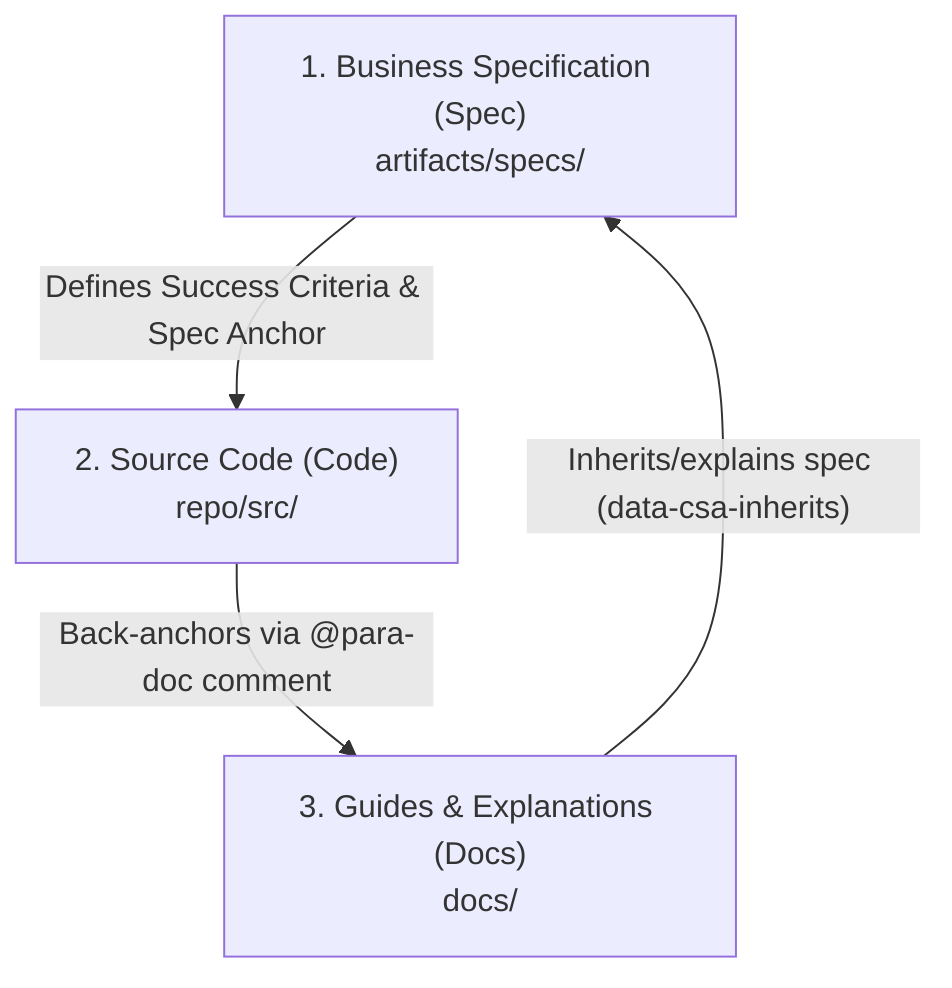

# CSA Traceability & Alignment (Spec ↔ Code ↔ Docs)

In the PARA Workspace development model, **CSA (Convergent Specification Architecture)** acts as the three-legged stool ensuring total synchronization between: **Business Specifications (Spec)**, **Source Code (Code)**, and **Explanatory Guides (Docs)**.

Enforcing these three coupled relationships prevents documentation drift and business logic drift entirely.

---

## 📐 1. The Three Tiers of CSA Traceability

The codebase graph analyzer (`para-graph`) statically parses and validates the following closed-loop relationships:



### 🔹 Relation 1: Spec ➔ Code (Spec Implementation)
*   **Meaning**: Ensures that all Success Criteria and business rules defined in the Spec file are actually implemented in the running code.
*   **Mechanism**: In the spec file (e.g., `spec-auth.md`), we declare unique anchors like `id="csa-auth-login"`. In the codebase, we place matching comments to link directly to this specification.

### 🔹 Relation 2: Code ➔ Docs (Code Documentation)
*   **Meaning**: Enables developers and AI Agents to instantly look up technical explanations or relevant documentation of complex files/functions directly from the editor.
*   **Mechanism**: Established via the **Short-form Reference** annotation `// @para-doc [#csa-id]` placed immediately above a class/function declaration (e.g. `// @para-doc [#csa-auth-login]`). The graph compiler resolves this CSA ID dynamically via SQLite, removing the need to couple the comment to a physical file path.

### 🔹 Relation 3: Docs ➔ Spec (Business Inheritance)
*   **Meaning**: Guarantees that guides and documentation reflect approved specifications without inventing outdated or imaginary logic.
*   **Mechanism**: Declared using the HTML inheritance attribute in the Markdown document:
    ```html
    <span data-csa-inherits="csa-auth-login">Technical description...</span>
    ```

---

## 🔄 2. Distinguishing the Two Distinct CSA Traceability Flows

To implement traceability correctly, developers must distinguish between two parallel ID flows serving different compliance gates (Tiers):

### 1. Spec-Driven Traceability Flow (Tier 1 Spec Gate)
*   **Goal**: Ensures business requirements from the Specifications (Spec) are fully implemented in code (Code) and consistently explained in the documentation (Docs).
*   **ID Flow Path**:
    *   **Starts at Spec**: Declare the business requirement ID as an HTML anchor (e.g., `<span id="csa-auth-login">`).
    *   **Maps to Code**: The code file contains a `@para-doc` comment linking to that ID (e.g., `// @para-doc [#csa-auth-login]`).
    *   **Inherits to Docs**: The documentation markdown file inherits this requirement using the inherits attribute: `<span data-csa-inherits="csa-auth-login">`.
*   **Gate Type**: **Hard Gate (100% threshold)**. The CLI pipeline fails and blocks Git commits if any spec-level anchor is unmapped or dangling.

### 2. Double-Binding Traceability Flow (Tier 2 Doc Gate)
*   **Goal**: Binds technical code components (purely structural elements without specifications, such as helpers or setup files) to technical guides to allow bidirectional lookups.
*   **Link Path**:
    *   **Docs ➔ Code**: Documentation specifies the code component it details: `<!-- @graph-node: src/utils/helper.ts:formatDate -->`.
    *   **Code ➔ Docs**: Code contains a `@para-doc` comment pointing back to the document anchor: `// @para-doc [#csa-doc-helper]`.
*   **Gate Type**: **Soft Gate (50% threshold)**. Measures documentation maturity index and displays coverage stats on the Quality Dashboard.

---

## 🔴 3. Strict Unidirectional Flow of ID Generation

This is the golden rule for maintaining ID identifier integrity across the project:

<blockquote>
  <strong>CSA identifiers (csa-*) MUST originate in the Specification file (Spec) first ➔ mapping to Code ➔ mapping to Docs. Never the other way around.</strong>
</blockquote>

*   **No Backwards Generation**: Never invent an anchor ID in the Docs or Code and trace it backwards. A CSA ID represents an audited business requirement.
*   **Dangling Link Prevention**: If code or documentation references a CSA ID that does not exist in `artifacts/specs/`, the static analyzer flags it as a **Dangling Inherits** or **Dangling Edge** error, immediately blocking Git commit pipelines.

---

## 🛡️ 4. CLI Audit Gates (CI/CD Enforcement)

When running local audits or CI/CD pipelines via the CLI command:
```bash
./para para-graph audit csa [project-name]
```

The system enforces two strict gatekeeping tiers:
1.  **Tier 1: Specs (Hard Gate)**: Requires a **100%** coverage rate of specs to code. Any unlinked specification anchor or dangling reference triggers a test failure (Exit Code `1`), blocking Git commits.
2.  **Tier 2: Docs (Soft Gate)**: Requires a **50%** coverage rate of guides. This acts as a maturity index rather than a workflow blocker.

---

## 💡 Suggested Commands & Prompts

*   **Audit CSA compliance before committing code**:
    ```text
    /para para-graph audit csa [project-name]
    ```
*   **Automatically fix drifted `@para-doc` code comments**:
    ```text
    /para para-graph fix csa [project-name]
    ```
*   **Scan available spec IDs for reference**:
    ```text
    List existing csa-* spec anchors defined in the specs folder of [project-name]
    ```
