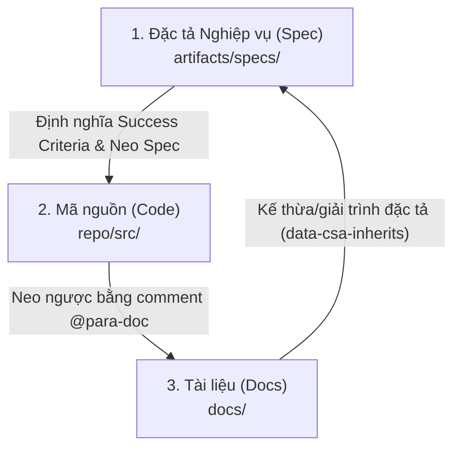

# Đối soát Nghiệp vụ & Tài liệu (CSA Traceability: Spec ↔ Code ↔ Docs)

Trong mô hình phát triển phần mềm của PARA Workspace, **CSA (Convergent Specification Architecture)** đóng vai trò là "chân kiềng" đảm bảo tính thống nhất tối đa giữa ba thành phần: **Đặc tả Nghiệp vụ (Spec)**, **Mã nguồn (Code)**, và **Tài liệu thuyết minh (Docs)**.

Việc thiết lập và kiểm soát 3 mối quan hệ tương tác này giúp ngăn ngừa hoàn toàn hiện tượng trôi lệch logic và trôi lệch tài liệu kỹ thuật.

---

## 📐 1. Ba mối quan hệ chân kiềng của CSA

Đồ thị mã nguồn (`para-graph`) theo dõi và phân tích tĩnh 3 luồng liên kết khép kín sau:



### 🔹 Mối quan hệ 1: Spec ➔ Code (Hiện thực hóa Đặc tả)
*   **Ý nghĩa**: Đảm bảo tất cả các Success Criteria và quy tắc nghiệp vụ định nghĩa trong Spec đều được viết code để chạy thực tế.
*   **Cách thức**: Trong file spec (ví dụ: `spec-auth.md`), ta định nghĩa các neo đặc tả `id="csa-auth-login"`. Trong code thực thi, ta đặt neo comment tương ứng để trỏ về đặc tả này.

### 🔹 Mối quan hệ 2: Code ➔ Docs (Thuyết minh Mã nguồn)
*   **Ý nghĩa**: Đảm bảo lập trình viên và AI Agent có thể tra cứu nhanh chóng tài liệu thuyết minh hoặc bài viết giải trình kỹ thuật liên quan của một đoạn code phức tạp trực tiếp từ editor.
*   **Cách thức**: Sử dụng cú pháp chú thích rút gọn **Short-form Reference** `// @para-doc [#csa-id]` ngay trước khai báo hàm/class trong code (ví dụ: `// @para-doc [#csa-auth-login]`). Hệ thống sẽ tự động quét định danh CSA ID này qua SQLite DB để liên kết đến tài liệu mà không cần ghi rõ tên file Markdown, tránh rủi ro hỏng liên kết khi tài liệu đổi tên/di chuyển.

### 🔹 Mối quan hệ 3: Docs ➔ Spec (Kế thừa nghiệp vụ)
*   **Ý nghĩa**: Đảm bảo tài liệu thuyết minh kỹ thuật kế thừa đúng các nghiệp vụ đã phê duyệt của Spec, không tự suy diễn cấu trúc.
*   **Cách thức**: Sử dụng thuộc tính kế thừa trong HTML của file Markdown tài liệu:
    ```html
    <span data-csa-inherits="csa-auth-login">Nội dung giải trình kỹ thuật...</span>
    ```

---

## 🔄 2. Phân biệt hai Luồng đối soát độc lập trong CSA

Để triển khai chuẩn xác, lập trình viên cần phân biệt rõ hai luồng ID chạy song song phục vụ cho hai cổng kiểm soát (Tiers):

### 1. Luồng đối soát Đặc tả Nghiệp vụ (Spec-Driven Traceability / Tier 1 Spec Gate)
*   **Mục tiêu**: Đảm bảo nghiệp vụ từ Đặc tả (Spec) được cài đặt đầy đủ trong mã nguồn (Code) và giải trình nhất quán trong Tài liệu (Docs).
*   **Luồng ID**:
    *   **Bắt đầu từ Spec**: Định nghĩa ID nghiệp vụ dưới dạng HTML anchor (ví dụ: `<span id="csa-auth-login">`).
    *   **Khớp sang Code**: File code cắm comment `@para-doc` liên kết đến ID đó (ví dụ: `// @para-doc [#csa-auth-login]`).
    *   **Kế thừa sang Docs**: File tài liệu thuyết minh kỹ thuật chứa thuộc tính kế thừa để trỏ ngược về Spec: `<span data-csa-inherits="csa-auth-login">`.
*   **Tính chất cổng**: **Hard Gate (Cổng Cứng - Yêu cầu 100%)**. CLI sẽ báo thất bại và chặn commit Git nếu phát hiện bất kỳ neo nghiệp vụ nào chưa được code hoặc bị lỗi mồ côi.

### 2. Luồng đối soát Tài liệu Kỹ thuật (Double-Binding Traceability / Tier 2 Doc Gate)
*   **Mục tiêu**: Liên kết mã nguồn kỹ thuật thuần túy (không có đặc tả nghiệp vụ, ví dụ: helper utils, API router setups) với tài liệu giải nghĩa tương ứng nhằm giúp lập trình viên tra cứu dễ dàng từ cả hai chiều.
*   **Luồng liên kết**:
    *   **Docs ➔ Code**: Tài liệu Markdown cắm neo chỉ định thành phần code nó đang giải thích: `<!-- @graph-node: src/utils/helper.ts:formatDate -->`.
    *   **Code ➔ Docs**: File mã nguồn cắm comment `@para-doc` chỉ định neo tài liệu của nó: `// @para-doc [#csa-doc-helper]`.
*   **Tính chất cổng**: **Soft Gate (Cổng Mềm - Đề xuất 50%)**. Tính toán tỷ lệ bao phủ tài liệu để đánh giá độ hoàn thiện (Maturity) trên Dashboard chất lượng.

---

## 🔴 3. Nguyên tắc Neo Một Chiều (Strict Unidirectional Flow)

Đây là quy tắc tối quan trọng để giữ toàn vẹn hệ thống định danh của dự án:

> **Định danh neo CSA (csa-*) BẮT BUỘC phải sinh ra từ Đặc tả gốc (Spec) ➔ sang Code ➔ sang Docs, chứ KHÔNG ĐƯỢC ngược lại.**

*   **Không đi ngược**: Tuyệt đối không tự tiện nghĩ ra một định danh neo mới từ file Docs hay Code rồi trỏ ngược lại. Định danh CSA là duy nhất và đại diện cho một yêu cầu nghiệp vụ đã được phê duyệt.
*   **Lỗi dangling (mồ côi)**: Nếu code hoặc tài liệu trỏ đến một ID CSA không tồn tại trong thư mục Spec (`artifacts/specs/`), CLI audit sẽ đánh giá là lỗi **Dangling Inherits** hoặc **Dangling Edges** và lập tức chặn không cho commit code.

---

## 🛡️ 4. Cơ chế Kiểm soát & Gating của CLI

Khi chạy kiểm toán cục bộ hoặc trên CI/CD thông qua câu lệnh:
```bash
./para para-graph audit csa [project-name]
```

Hệ thống sẽ thực thi chốt chặn hai lớp (Gating Tiers):
1.  **Tier 1: Specs (Hard Gate - Cổng Cứng)**: Yêu cầu tỷ lệ bao phủ của Spec so với code phải đạt **100%**. Nếu có bất kỳ neo đặc tả nào chưa được code liên kết, hoặc có neo mồ côi $\rightarrow$ CLI trả về Exit Code `1` (Chặn Git commit).
2.  **Tier 2: Docs (Soft Gate - Cổng Mềm)**: Yêu cầu tỷ lệ bao phủ tài liệu hướng dẫn đạt **50%**. Đây là chỉ số khuyến khích để đo độ chín của tài liệu (Maturity).

---

## 💡 Đề xuất câu lệnh & Prompt gợi ý

*   **Chạy kiểm toán CSA trước khi commit để tránh hỏng gate**:
    ```text
    /para para-graph audit csa [project-name]
    ```
*   **Tự động sửa lỗi sai lệch neo comment `@para-doc` bị trượt dòng**:
    ```text
    /para para-graph fix csa [project-name]
    ```
*   **Quét các ID đặc tả có sẵn để tham chiếu**:
    ```text
    Liệt kê các neo đặc tả csa-* hiện có trong thư mục specs của dự án [project-name]
    ```
