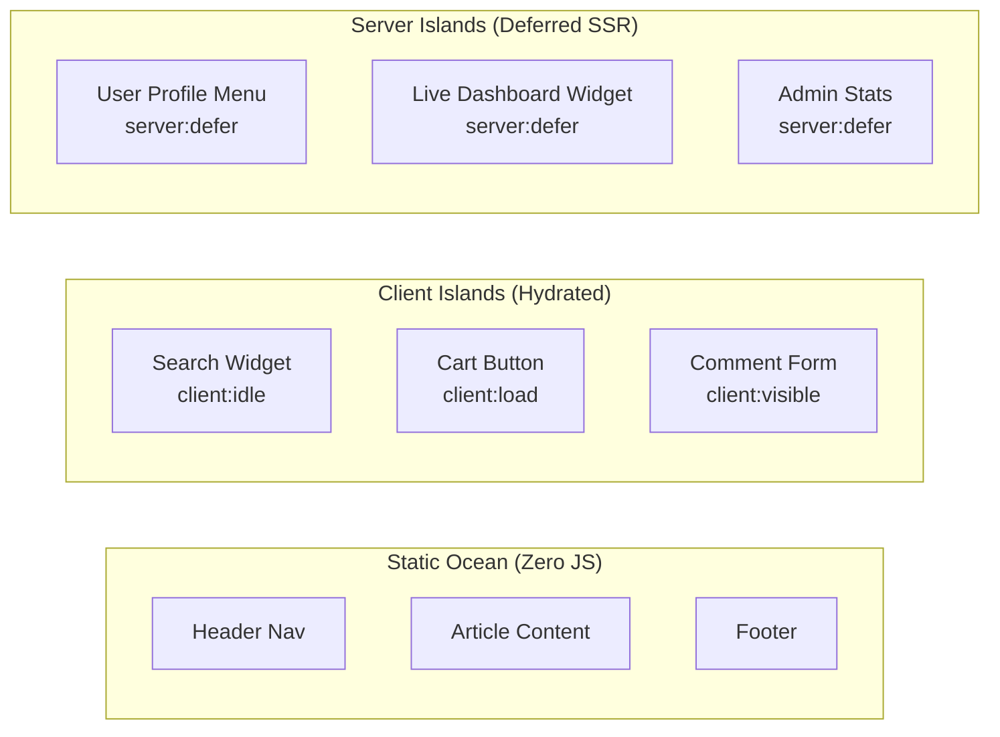
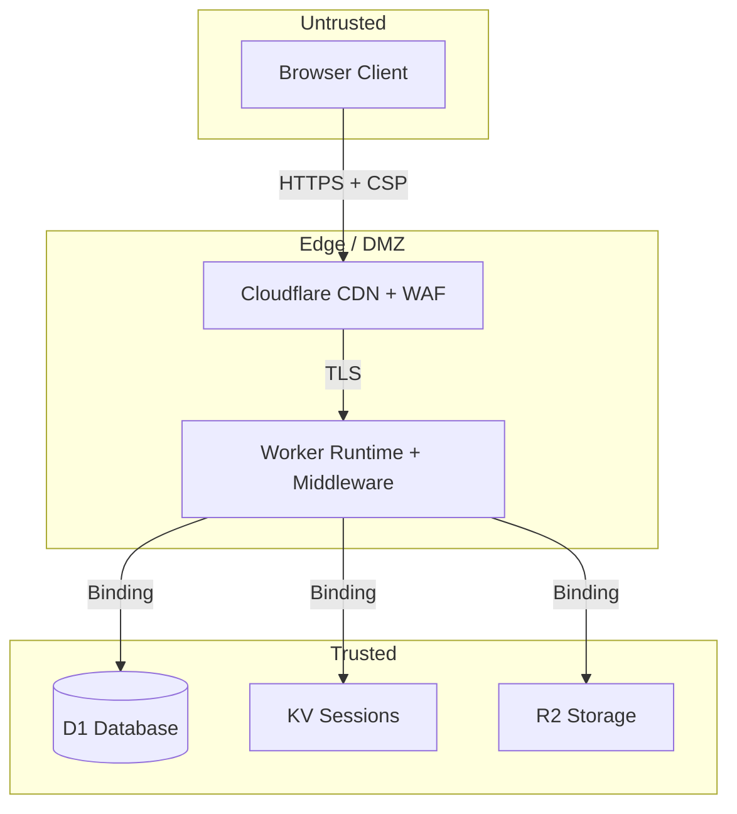

# Reference Architecture: Astro 7 Fullstack Application

> **Astro Version:** 7.x (Released June 2026)
> **Paradigm:** Content-first hybrid rendering with Server Islands, Actions, and edge-native data layer.
> **Key Differentiator:** Zero-JS by default + selective hydration + Rust-powered build pipeline (Vite 8 + Rolldown).

## 1. Topology

```mermaid
graph TD
    Client[Browser] -->|HTTPS| Edge[Cloudflare Edge CDN]

    subgraph "Static Layer (Cached)"
        Edge -->|Cache HIT| StaticHTML[Pre-rendered HTML Pages]
        Edge -->|Hashed Assets| AstroAssets["/_astro/ optimized JS/CSS/images"]
    end

    subgraph "Dynamic Layer (On-demand)"
        Edge -->|Cache MISS / SSR| Worker[Cloudflare Worker Runtime]
        Worker -->|server:defer| ServerIslands[Server Islands Renderer]
        Worker -->|Actions| ActionHandler[Astro Actions Handler]
        Worker -->|src/fetch.ts| FetchEntry[Advanced Routing Entry Point]
    end

    subgraph "Data Layer"
        Worker -->|SQL| D1[(Cloudflare D1)]
        Worker -->|Sessions/Cache| KV[Cloudflare KV]
        Worker -->|Files/Media| R2[Cloudflare R2 Storage]
    end

    FetchEntry -->|astro()| Worker
```

*   **Deployment Target**: Cloudflare Pages (static assets + Workers runtime) via `@astrojs/cloudflare` adapter.
*   **Build Pipeline**: Rust-based `.astro` compiler + Vite 8 (Rolldown bundler) → 15-61% faster builds vs Astro 6.
*   **Rendering Modes**: Hybrid — static by default, SSR opt-in per route.
*   **Storage Engines**:
    *   **D1**: Structured relational data (users, content, app state).
    *   **KV**: Session tokens (TTL-based), feature flags, cached lookups.
    *   **R2**: Binary object storage (uploads, images, PDFs).

## 2. API & Communication Design

### Output Mode Configuration

```typescript
// astro.config.mjs
import { defineConfig } from 'astro/config';
import cloudflare from '@astrojs/cloudflare';

export default defineConfig({
  output: 'hybrid',              // Static by default, SSR opt-in
  adapter: cloudflare({
    platformProxy: { enabled: true }
  }),
});
```

### Route Rendering Strategy

| Route Pattern | Rendering | `prerender` | Rationale |
|:--|:--|:--|:--|
| `/`, `/about`, `/blog/*` | Static (SSG) | `true` (default) | Content-heavy, rarely changes |
| `/dashboard/*` | Server (SSR) | `false` | User-specific, auth-gated |
| `/api/*` | Server (SSR) | `false` | Dynamic endpoints |
| `/admin/*` | Server (SSR) | `false` | Admin panel, real-time data |

```astro
---
// src/pages/dashboard/index.astro
export const prerender = false; // Opt-in to SSR for this route

const user = Astro.locals.user;
if (!user) return Astro.redirect('/login');
---
<DashboardLayout>
  <UserProfile server:defer>
    <LoadingSkeleton slot="fallback" />
  </UserProfile>
</DashboardLayout>
```

### Astro Actions (Type-safe Mutations)

```typescript
// src/actions/index.ts
import { defineAction } from 'astro:actions';
import { z } from 'astro:schema';

export const server = {
  createPost: defineAction({
    accept: 'form',
    input: z.object({
      title: z.string().min(1).max(200),
      content: z.string().min(10),
    }),
    handler: async (input, context) => {
      const db = getDb(context.locals.runtime.env.DB);
      const user = context.locals.user;
      if (!user) throw new Error('Unauthorized');

      const [post] = await db.insert(posts).values({
        title: input.title,
        content: input.content,
        authorId: user.id,
      }).returning();

      return { success: true, postId: post.id };
    },
  }),
};
```

### Advanced Routing (`src/fetch.ts`) — Astro 7 Feature

```typescript
// src/fetch.ts — Astro 7 advanced routing entry point
import { FetchState, astro } from 'astro/fetch';

export default {
  async fetch(request: Request, env: Env): Promise<Response> {
    const state = new FetchState(request);
    const url = new URL(request.url);

    // Custom pre-processing: API versioning, logging, A/B testing
    if (url.pathname.startsWith('/api/v2/')) {
      // Route to alternative handler or rewrite
    }

    // Structured JSON logging for AI agent dev mode
    console.log(JSON.stringify({
      timestamp: Date.now(),
      method: request.method,
      path: url.pathname,
      cf: request.cf?.country,
    }));

    // Execute standard Astro pipeline (sessions, caching, middleware, rendering)
    return await astro(state);
  },
};
```

### Error Format

```json
{ "success": false, "error": { "code": "VALIDATION_ERROR", "message": "Title is required" } }
```

## 3. Database & Storage Architecture

### Drizzle ORM Schema (D1 / SQLite)

```typescript
// src/db/schema.ts
import { sqliteTable, text, integer } from 'drizzle-orm/sqlite-core';

export const users = sqliteTable('users', {
  id: text('id').primaryKey(),
  email: text('email').unique().notNull(),
  passwordHash: text('password_hash').notNull(),
  displayName: text('display_name'),
  role: text('role', { enum: ['admin', 'user', 'editor'] }).default('user'),
  createdAt: integer('created_at', { mode: 'timestamp' }).defaultNow(),
  updatedAt: integer('updated_at', { mode: 'timestamp' }).defaultNow(),
});

export const posts = sqliteTable('posts', {
  id: text('id').primaryKey(),
  authorId: text('author_id').references(() => users.id, { onDelete: 'cascade' }),
  title: text('title').notNull(),
  content: text('content'),
  slug: text('slug').unique().notNull(),
  status: text('status', { enum: ['draft', 'published', 'archived'] }).default('draft'),
  publishedAt: integer('published_at', { mode: 'timestamp' }),
  createdAt: integer('created_at', { mode: 'timestamp' }).defaultNow(),
});

export const sessions = sqliteTable('sessions', {
  id: text('id').primaryKey(),
  userId: text('user_id').references(() => users.id, { onDelete: 'cascade' }),
  expiresAt: integer('expires_at', { mode: 'timestamp' }).notNull(),
  createdAt: integer('created_at', { mode: 'timestamp' }).defaultNow(),
});
```

### Database Initialization

```typescript
// src/lib/db.ts
import { drizzle } from 'drizzle-orm/d1';
import * as schema from '../db/schema';

export const getDb = (d1: D1Database) => drizzle(d1, { schema });
```

### Migrations

```bash
# Generate migration from schema changes
npx drizzle-kit generate --dialect sqlite --schema src/db/schema.ts --out migrations/
# Apply to local D1
npx wrangler d1 migrations apply DB --local
# Apply to remote D1
npx wrangler d1 migrations apply DB --remote
```

### Indexes & Optimization

```sql
CREATE INDEX idx_posts_author ON posts(author_id);
CREATE INDEX idx_posts_status_published ON posts(status, published_at DESC);
CREATE INDEX idx_posts_slug ON posts(slug);
CREATE INDEX idx_sessions_user ON sessions(user_id);
CREATE INDEX idx_sessions_expires ON sessions(expires_at);
```

## 4. Software Topology

### Project Structure

```
src/
├── actions/              # Astro Actions (type-safe server mutations)
│   └── index.ts
├── components/           # UI Components
│   ├── islands/          # Interactive client islands (React/Svelte/Vue)
│   ├── server/           # Server Islands (server:defer components)
│   └── static/           # Pure Astro components (zero JS)
├── content/              # Content Collections (Markdown/MDX + Zod schemas)
│   ├── config.ts         # Collection definitions
│   ├── blog/             # Blog posts collection
│   └── docs/             # Documentation collection
├── db/
│   └── schema.ts         # Drizzle ORM schema definitions
├── layouts/              # Page layouts (Base, Auth, Dashboard, Admin)
├── lib/                  # Shared utilities
│   ├── auth.ts           # Better Auth configuration
│   ├── db.ts             # Drizzle D1 initialization
│   └── utils.ts          # Helper functions
├── middleware.ts          # Route protection, session validation
├── fetch.ts              # Astro 7 Advanced Routing entry point
└── pages/
    ├── index.astro       # Home (static)
    ├── blog/             # Blog routes (static, Content Collections)
    ├── login.astro       # Auth page (SSR)
    ├── dashboard/        # User dashboard (SSR, auth-gated)
    ├── admin/            # Admin panel (SSR, role-gated)
    └── api/
        ├── auth/[...auth].ts  # Better Auth catch-all handler
        └── healthz.ts         # Health check endpoint
```

### Component Architecture (Islands Strategy)



**Hydration Directives Reference:**

| Directive | When to Use | JS Impact |
|:--|:--|:--|
| *(none)* | Pure static content, no interactivity needed | Zero JS |
| `client:load` | Must be interactive immediately (CTAs, nav menus) | Loads on page load |
| `client:idle` | Interactive but not urgent (search, filters) | Loads when browser idle |
| `client:visible` | Below the fold (comments, carousels) | Loads when scrolled into view |
| `server:defer` | Dynamic data, personalized content, auth-dependent | Server-rendered post-load |

### State Management (Cross-Island Communication)

```typescript
// src/stores/cart.ts — Nanostores (framework-agnostic)
import { atom, computed } from 'nanostores';

export const cartItems = atom<CartItem[]>([]);
export const cartTotal = computed(cartItems, items =>
  items.reduce((sum, item) => sum + item.price * item.quantity, 0)
);

// Usage in ANY framework island (React, Svelte, Vue):
// import { useStore } from '@nanostores/react';
// const items = useStore(cartItems);
```

## 5. Security Architecture & Threat Model

### Authentication (Better Auth + D1)

```typescript
// src/lib/auth.ts
import { betterAuth } from 'better-auth';
import { drizzleAdapter } from 'better-auth/adapters/drizzle';
import { drizzle } from 'drizzle-orm/d1';

export const getAuth = (d1: D1Database) => {
  return betterAuth({
    database: drizzleAdapter(drizzle(d1), { provider: 'sqlite' }),
    session: {
      cookieCache: { enabled: true, maxAge: 60 * 5 },
    },
    emailAndPassword: { enabled: true },
    // socialProviders: { github: { ... }, google: { ... } },
  });
};
```

### Middleware (Route Protection)

```typescript
// src/middleware.ts
import { defineMiddleware } from 'astro:middleware';
import { getAuth } from './lib/auth';

const PROTECTED_ROUTES = ['/dashboard', '/admin', '/api/actions'];
const ADMIN_ROUTES = ['/admin'];

export const onRequest = defineMiddleware(async (context, next) => {
  const { pathname } = context.url;
  const isProtected = PROTECTED_ROUTES.some(r => pathname.startsWith(r));

  if (isProtected) {
    const auth = getAuth(context.locals.runtime.env.DB);
    const session = await auth.api.getSession({ headers: context.request.headers });

    if (!session?.user) {
      return context.redirect('/login?redirect=' + pathname);
    }

    context.locals.user = session.user;
    context.locals.session = session.session;

    // Role-based access control
    if (ADMIN_ROUTES.some(r => pathname.startsWith(r)) && session.user.role !== 'admin') {
      return new Response('Forbidden', { status: 403 });
    }
  }

  return next();
});
```

### Trust Boundary



### Security Headers

```
// _headers (Cloudflare Pages)
/*
  X-Frame-Options: DENY
  X-Content-Type-Options: nosniff
  Referrer-Policy: strict-origin-when-cross-origin
  Permissions-Policy: camera=(), microphone=(), geolocation=()
  Strict-Transport-Security: max-age=31536000; includeSubDomains; preload

/dashboard/*
  Content-Security-Policy: default-src 'self'; script-src 'self'; style-src 'self' 'unsafe-inline'; img-src 'self' data: https:; connect-src 'self';
```

## 6. Observability & Day-2 Operations

*   **Structured Logging**: JSON logs via `src/fetch.ts` entry point → Cloudflare Logpush or `wrangler tail`.
    ```json
    {
      "timestamp": 1719964800000,
      "level": "INFO",
      "method": "POST",
      "path": "/api/actions/createPost",
      "userId": "usr_abc123",
      "duration_ms": 28,
      "status": 201,
      "country": "VN"
    }
    ```
*   **Metrics**: Cloudflare Workers Analytics (invocations, errors, CPU time, subrequest count).
*   **Health Check**: `GET /api/healthz` → checks D1 connectivity + KV availability.
    ```typescript
    // src/pages/api/healthz.ts
    export const prerender = false;
    export const GET: APIRoute = async ({ locals }) => {
      try {
        const db = getDb(locals.runtime.env.DB);
        await db.run(sql`SELECT 1`);
        return Response.json({ status: 'ok', timestamp: Date.now() });
      } catch (e) {
        return Response.json({ status: 'error', message: e.message }, { status: 503 });
      }
    };
    ```
*   **AI Agent Dev Mode** (Astro 7): Auto-detects AI coding environment → runs dev server in background with structured JSON output for machine-readable diagnostics.
*   **CDN Cache Invalidation**: Experimental CDN cache providers (Cloudflare) — tag-based invalidation for dynamic content refresh without full rebuild.

## When to Use This Pattern vs Others

| Scenario | Use This Pattern | Use Instead |
|:--|:--|:--|
| Content site + user accounts + dashboard | ✅ Yes | — |
| E-commerce storefront + cart + checkout | ✅ Yes | — |
| Headless CMS admin panel | ✅ Yes | — |
| Heavy SPA (complex client state, no static pages) | ❌ | Next.js + Supabase |
| Pure REST API backend (no frontend) | ❌ | Workers + Hono / FastAPI |
| Pure static blog/docs (no auth, no dynamic) | Overkill | `astro-static.md` pattern |
